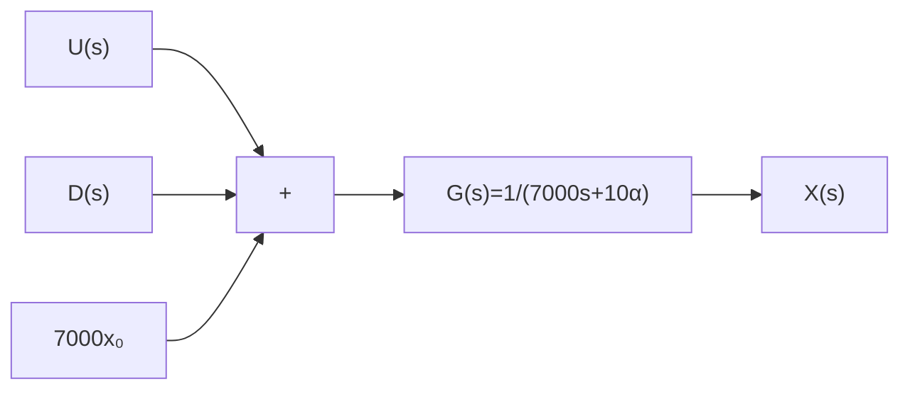

# 7.1 引子——燃烧卡路里

在第 2 章例 2.1.1 中, 我们分析了体重变化与热量输入的关系, 并建立了体重变化系统的动态微分方程, 即

$$7 0 0 0 \frac {\mathrm{d} m}{\mathrm{d} t} + 1 0 \alpha m = E _ {\mathrm{i}} - E _ {\mathrm{a}} - \alpha (6. 2 5 h - 5 a + S) \tag {7.1.1}$$

其中， $m(t)$ 是体重； $\alpha$ 是劳动强度系数，始终大于零； $E_{i}$ 是热量摄入，来源于饮食； $E_{a}$ 是额外的运动消耗； $h$ 是身高； $a$ 是年龄； $S$ 是一个和性别相关的调整系数，其中，男性： $S = 5$ ；女性： $S = -161$ 。为进一步简化式(7.1.1)，令 $6.25h - 5a + S = C (C$ 是常数），因为一个人成年之后的身高和性别一般都是不变的，而年龄的变化也比较缓慢。此时式(7.1.1)可以化简为

$$7 0 0 0 \frac {\mathrm{d} m (t)}{\mathrm{d} t} + 1 0 \alpha m (t) = E _ {\mathrm{i}} - E _ {\mathrm{a}} - \alpha C \tag {7.1.2}$$

将式(7.1.2)中人体体重变化考虑为一个动态系统,定义其输入是 $u(t) = E_{\mathrm{i}} - E_{\mathrm{a}}$ ,它代表了每日的净热量输入(即饮食中的热量摄入减去额外运动的消耗)。系统的输出是体重 $x(t) = m(t)$ 。此外，引入 $d(t) = -\alpha C$ ，代表系统的扰动量(Disturbance)，在本例中是常数。此时式(7.1.2)可以写成

$$7 0 0 0 \frac {\mathrm{d} x (t)}{\mathrm{d} t} + 1 0 \alpha x (t) = u (t) + d (t) \tag {7.1.3}$$

对式(7.1.3)等号两边进行拉普拉斯变换,可得

$$
\begin{array}{l} 7 0 0 0 (s X (s) - x _ {0}) + 1 0 \alpha X (s) = U (s) + D (s) \\ \Rightarrow (7 0 0 0 s + 1 0 \alpha) X (s) = U (s) + D (s) + 7 0 0 0 x _ {0} \tag {7.1.4} \\ \end{array}
$$

其中， $x_0 = x(0)$ ，是输出 $x(t)$ 初始状态时的值，也就是初始体重。调整后可以得到动态系统的传递函数，即

$$G (s) = \frac {X (s)}{U (s) + D (s) + 7 0 0 0 x _ {0}} = \frac {1}{7 0 0 0 s + 1 0 \alpha} \tag {7.1.5}$$

flowchart

图 7.1.1 体重系统框图

其对应的系统框图如图 7.1.1 所示。

这是一个典型的一阶系统,根据第4章的分析,其中 $U(s)$ 和 $D(s)$ 是以阶跃形式作用在系统上,初始状态 $7000x_{0}$ 则是以冲激方式作用在系统上。通过传递函数极点分析系统的稳定性,令式(7.1.5)分母为0,得到 $G(s)$ 的特征方程为

$$
\begin{array}{l} 7 0 0 0 s + 1 0 \alpha = 0 \\ \Rightarrow s _ {\mathrm{p}} = - \frac {\alpha}{7 0 0} <   0 \tag {7.1.6} \\ \end{array}
$$

式(7.1.6)说明传递函数的极点在复平面的左半部分,根据第6章的分析,系统是渐近稳定的,同时满足BIBO稳定。因此,当输入 $U(s)+D(s)+7000x_{0}$ 有界的时候,输出也一定有界。

选取三个典型大学男生的情况作为案例分析。如表 7.1.1 所示,他们三人的初始体重都是 70kg,身高都是 175cm,年龄都是 20 岁。因为他们都是学生,日常的作息就是上课和学习,并没有大体力劳动,所以劳动强度系数选取 $\alpha = 1.3$ 。案例 1 和案例 3 中的两位每天都会摄入 2500kCal。这体现了大多数大学生的每日饮食标准: 包含 400g 米饭、2 个鸡蛋、3 份炒菜、1 个苹果、1 瓶可乐和 5 个烤串。案例 2 中的同学不吃烤串也不喝可乐,所以他的摄入比其他两个人每天少 400kCal,是 2100kCal。最后,案例 1 和案例 2 都是宅男,他们每天不运动,只靠基础消耗。但是案例 3 每天会慢跑 1 小时,额外消耗 500kCal。

表 7.1.1 体重系统案例分析
