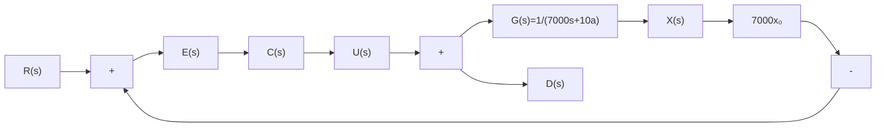
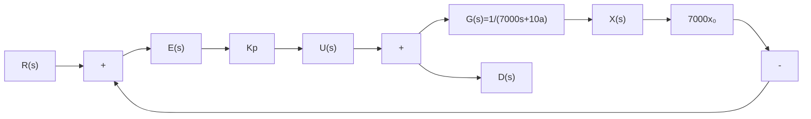

# 7.2 比例控制

7.1节的末尾提出了一个具体的控制问题: 如何通过调整饮食和运动帮助案例1的同学重新回到健康的体重(从90kg降到65kg)。要解决这个问题, 首先需要构建一个闭环反馈控制系统, 如图7.2.1所示, 引入参考值 $r(t)$ , 即目标体重, 在此例中它是一个常数, 即 $r(t) = r = 65\mathrm{kg}$ 。其所对应的拉普拉斯变换为 $R(s) = \frac{r}{s}$ 。参考值与输出之间的差距定义为误差 $e(t) = r(t) - x(t)$ , 其对应的拉普拉斯变换为 $E(s) = R(s) - X(s)$ 。 $C(s)$ 是控制器, 包含了我们需要设计的控制算法。误差信号通过控制器之后形成控制量, 即原动态系统的输入 $U(s) = E(s)C(s)$ 。

flowchart

图 7.2.1 体重闭环控制系统框图

人们在控制体重时会很自然地想到一种策略：当体重大于目标值的时候，那就多运动，少吃饭，而且超重得越多，就越要多运动，越要少吃饭。反之亦然。这种简单粗暴的策略被称为比例控制(Proportional Controller)，即系统的控制量与误差成正比，令

$$u (t) = K _ {\mathrm{P}} e (t) \tag {7.2.1a}$$

其中， $K_{p}>0$ ，称为比例增益(Proportional Gain)。其拉普拉斯变换为

$$U (s) = K _ {\mathrm{P}} E (s) \tag {7.2.1b}$$

使用比例控制的系统框图如图 7.2.2 所示。

flowchart

图 7.2.2 体重系统比例控制器闭环框图

此时,系统的输出可以表达为

$$
\begin{array}{l} X (s) = \frac {U (s) + D (s) + 7 0 0 0 x _ {0}}{7 0 0 0 s + 1 0 \alpha} = \frac {E (s) K _ {\mathrm{P}} + D (s) + 7 0 0 0 x _ {0}}{7 0 0 0 s + 1 0 \alpha} \\ = \frac {(R (s) - X (s)) K _ {\mathrm{P}} + D (s) + 7 0 0 0 x _ {0}}{7 0 0 0 s + 1 0 \alpha} \\ \Rightarrow X (s) = \frac {K _ {\mathrm{P}} R (s) + D (s) + 7 0 0 0 x _ {0}}{7 0 0 0 s + 1 0 \alpha + K _ {\mathrm{P}}} \tag {7.2.2} \\ \end{array}
$$

根据前面的定义， $d(t)=-\alpha C$ ，可得 $D(s)=-\frac{\alpha C}{s}$ 。又已知 $R(s)=\frac{r}{s}$ ，式(7.2.2)变为

$$X (s) = \frac {K _ {\mathrm{P}} \frac {r}{s} - \frac {\alpha C}{s} + 7 0 0 0 x _ {0}}{7 0 0 0 s + 1 0 \alpha + K _ {\mathrm{P}}} = \frac {K _ {\mathrm{P}} r - \alpha C + 7 0 0 0 x _ {0} s}{s (7 0 0 0 s + 1 0 \alpha + K _ {\mathrm{P}})} \tag {7.2.3}$$

根据式(7.2.3)， $X(s)$ 有两个极点，分别为 $s_{p1}=0$ 和 $s_{p2}=-\frac{K_{p}+10\alpha}{7000}$ 。其中， $s_{p1}$ 是输入 $U(s)$ 和扰动 $D(s)$ 的极点， $s_{p2}$ 是闭环传递函数的极点。对式(7.2.3)进行分式分解，可得
