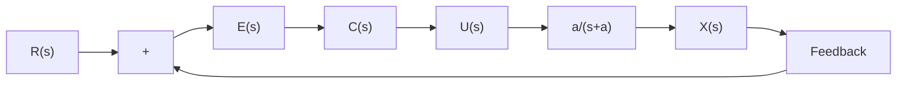

# 7.3.2 积分控制

本节将利用终值定理来辅助设计控制器以消除系统的稳态误差。为了简化分析,我们先将体重控制的案例暂时放一下,从一个一般性例子着手分析。考虑一个零初始条件且不含扰动的一阶系统,其系统框图如图7.3.1所示,其中a>0。控制的目标是令系统的输出x(t)等于参考值 $r(t)=r$ (常数)。

flowchart

图 7.3.1 一阶闭环控制系统框图

根据图 7.3.1, 系统输出 $X(s)$ 可以表达为

$$
\begin{array}{l} X (s) = U (s) \frac {a}{s + a} = E (s) C (s) \frac {a}{s + a} = (R (s) - X (s)) C (s) \frac {a}{s + a} \\ \Rightarrow X (s) = \frac {a R (s) C (s)}{s + a + a C (s)} = \frac {a \frac {r}{s} C (s)}{s + a + a C (s)} \tag {7.3.3} \\ \end{array}
$$

其中， $R(s)=\frac{r}{s}$ ，是常数参考值的拉普拉斯变换。当使用比例控制器时， $C(s)=K_{p}$ ，代入式(7.3.3)可得

$$X (s) = \frac {a \frac {r}{s} K _ {\mathrm{P}}}{s + a + a C (s)} = \frac {a r K _ {\mathrm{P}}}{s (s + a + a K _ {\mathrm{P}})} \tag {7.3.4}$$

对式 $(7.3.4)$ 使用终值定理,可得

$$
\begin{array}{l} \lim _ {t \rightarrow \infty} x (t) = \lim _ {s \rightarrow 0} s X (s) = \lim _ {s \rightarrow 0} \frac {a r K _ {\mathrm{P}}}{s (s + a + a K _ {\mathrm{P}})} \\ = \lim _ {s \rightarrow 0} \frac {a r K _ {\mathrm{P}}}{s + a + a K _ {\mathrm{P}}} = \frac {a r K _ {\mathrm{P}}}{a + a K _ {\mathrm{P}}} = \frac {r K _ {\mathrm{P}}}{1 + K _ {\mathrm{P}}} \tag {7.3.5} \\ \end{array}
$$

其稳态误差为

$$e _ {\mathrm{ss}} = r - \lim _ {t \rightarrow \infty} x (t) = r - \frac {r K _ {\mathrm{P}}}{1 + K _ {\mathrm{P}}} = \frac {1}{1 + K _ {\mathrm{P}}} r \tag {7.3.6}$$

此外，也可以直接根据图7.3.1得到误差的拉普拉斯变换为

$$
\begin{array}{l} E (s) = R (s) - E (s) C (s) \frac {a}{s + a} \\ \Rightarrow E (s) = \frac {(s + a) R (s)}{s + a + a C (s)} \tag {7.3.7} \\ \end{array}
$$

将 $R(s) = \frac{r}{s}$ 和 $C(s) = K_{\mathrm{P}}$ 代入式(7.3.7)，得到

$$E (s) = \frac {(s + a) \frac {r}{s}}{s + a + a K _ {\mathrm{P}}} = \frac {(s + a) r}{s (s + a + a K _ {\mathrm{P}})} \tag {7.3.8}$$

对式 $(7.3.8)$ 直接使用终值定理,得到

$$
\begin{array}{l} e _ {\mathrm{ss}} = \lim _ {t \rightarrow \infty} e (t) = \lim _ {s \rightarrow 0} s E (s) = \lim _ {s \rightarrow 0} \frac {(s + a) r}{s (s + a + a K _ {\mathrm{P}})} \\ = \lim _ {s \rightarrow 0} \frac {(s + a) r}{s + a + a K _ {\mathrm{P}}} = \frac {a r}{a + a K _ {\mathrm{P}}} = \frac {1}{1 + K _ {\mathrm{P}}} r \tag {7.3.9} \\ \end{array}
$$

式 $(7.3.9)$ 与式 $(7.3.6)$ 的结果一致。

式(7.3.9)说明,单纯依靠比例控制无法消除系统的稳态误差。因此需要设计不同的 $C(s)$ ,将 $R(s)=\frac{r}{s}$ 代入式(7.3.7)并使用终值定理,可得
