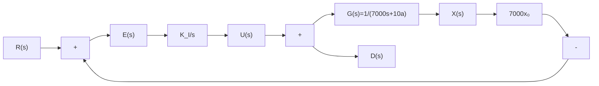
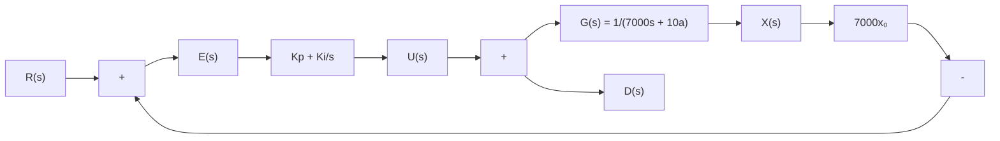

# 7.3.3 比例积分控制

7.3.2节说明,使用积分控制可以消除一阶系统的稳态误差。现在使用积分控制来调节体重,将 $C(s)=\frac{K_{1}}{s}$ 代入图7.2.1中,得到新的系统框图,如图7.3.3所示。

flowchart

图 7.3.3 体重系统积分控制框图

当选择 $K_{1}=1$ 时，系统输出 $x(t)$ 随时间的变化如图 7.3.4 所示。

line

| t    | x(t) |
| ---- | ---- |
| 0    | 90   |
| 500  | 30   |
| 1000 | 85   |
| 1500 | 40   |
| 2000 | 65   |
| 2500 | 55   |
| 3000 | 60   |

图 7.3.4 积分控制器下系统的输出随时间的变化

图 7.3.4 说明, 在积分控制器的帮助下(正如我们所设计的), 系统的输出最终会收敛于参考值 r = 65kg, 即使系统存在着扰动, 积分控制器依然成功地消除了稳态误差。比较图 7.3.4 和图 7.2.3(a), 会发现两个显著的区别。第一, 使用积分控制器后, 系统的输出存在振动和超调量。这是因为积分控制器的引入使得原来的一阶系统变成了二阶系统。第二, 在观察横轴时可以发现, 积分控制下的系统响应速度要远远慢于比例控制。从直观上理解, 积分控制需要误差的累加, 而累加则需要时间, 因此反应相对“迟钝”。

综上所述,比例控制可以使系统快速地响应,而积分控制可以消除稳态误差,如果将二者结合起来,便可以兼顾两种控制器的优点,即比例积分控制。这是在工业界中应用最为广泛的控制方法。其控制器的拉普拉斯变换为 $C(s)=K_{\mathrm{P}}+\frac{K_{\mathrm{I}}}{s}$ ,系统的控制量可以写成

$$
U (s) = K _ {\mathrm{P}} E (s) + \frac {K _ {\mathrm{I}}}{s} E (s) \tag {7.3.16a}
$$

其对应的时域表达为

$$
u (t) = K _ {\mathrm{P}} e (t) + K _ {\mathrm{I}} \int_ {0} ^ {t} e (t) \mathrm{d} t \tag {7.3.16b}
$$

在使用比例积分控制器后，体重控制的系统框图如图7.3.5所示。

flowchart

图 7.3.5 体重系统比例积分控制器闭环框图

选取 $K_{P}=200, K_{I}=1$ 时，系统输出 $x(t)$ 随时间的变化如图 7.3.6(a) 所示，控制量 $u(t)$ 随时间的变化如图 7.3.6(b) 所示。可以发现，比例积分控制很好地将系统稳定在参考值上。而且相较于积分控制，其响应速度有了很大的改善。读者可以自己搭建这样的一个系统并调整不同的比例积分增益 ( $K_{P}$ 和 $K_{I}$ )，观察系统的响应。在实际工程中，参数的调节是很重要的工作，很大程度上依靠经验，但也有一些小技巧，本书的重点是将控制器的原理介绍清楚，故不涉及调参的部分，有兴趣的读者可以参考其他资料。

line

| t    | x(t) |
| ---- | ---- |
| 0    | 90   |
| 250  | 55   |
| 500  | 65   |
| 750  | 65   |
| 1000 | 65   |

(a) 系统输出 $x(t)$ 随时间的变化

line

| t    | u(t)   |
| ---- | ------ |
| 0    | -5000  |
| 250  | 2150   |
| 500  | 2150   |
| 750  | 2150   |
| 1000 | 2150   |

(b) 系统控制量 $u(t)=K_{\mathrm{p}}e(t)+K_{1}\int_{0}^{t}e(t)\mathrm{d}t$ 随时间的变化  
图 7.3.6 比例积分控制下系统的输出与控制量随时间的变化

比例积分控制—PI 控制器应用内容请扫描此二维码观看。
