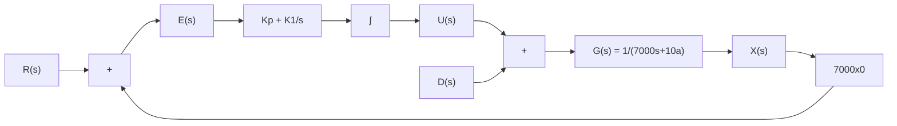

# 7.4 含有限制条件的控制器设计

很遗憾,前面几节推导出的控制器在现实生活中都无法实现,以最后的比例积分控制器为例:根据图7.3.6(b),在初始条件下,控制量高达 $u(t)=-5000kCal$ 。请读者回想一下控制量 $u(t)$ 的物理意义,它是原体重动态系统的输入,在7.1节中定义 $u(t)=E_{i}-E_{a}$ 。它代表了净热量输入(食物热量摄入减去额外运动消耗)。因此-5000kCal就意味着要不吃不喝的同时慢跑至少10小时。这当然不是一个长久的方法,如果真有人这样做的话,恐怕连一天都坚持不了。

在实际工程应用中,控制量在很多情况下都是有限制条件(约束)的,例如在自动巡航系统中的发动机转速和扭矩,空调系统中的最大出风量等,它们都有工作上限。体重控制系统的限制是每日的净热量输入应当在一个人可以承受的范围内。处理这类带约束的问题有很多的方法,这里介绍一个最简单的方式,在图7.3.5的框图中加入一个饱和函数(Saturation Function)来限制 $U(s)$ 幅度,如图7.4.1所示。

flowchart

图 7.4.1 含有限制的比例积分控制系统框图

饱和函数的定义为

$$
u (t) = \left\{ \begin{array}{l l} u _ {\max} & u (t) > u _ {\max} \\ u (t) & u _ {\max} \geqslant u (t) \geqslant u _ {\min} \\ u _ {\min} & u (t) <   u _ {\min} \end{array} \right. \tag {7.4.1}
$$

使用中根据具体情况设置输入的最大值 $u_{max}$ 和最小值 $u_{min}$ 。

在本例中,即使在减肥的状态下,一个二十几岁的男生也要保证每天最低 $1800\mathrm{kCal}$ 的饮食摄入量,同时他可以保证每天健身 1.5 小时,消耗约 $800\mathrm{kCal}$ 。这样的运动饮食已经属于比较极限的情况,需要强大的毅力才有可能坚持。如此算下来,每日净热量输入的最低值 $u_{\min} = E_{i} - E_{a} = 1000\mathrm{kCal}$ 。而他每天可以吃 $5000\mathrm{kCal}$ 且不运动,所以 $u_{\max} = 5000\mathrm{kCal}$ 。将上面的限制条件代入之后,得到新的系统的输出 $x(t)$ 与输入 $u(t)$ 随时间的变化,如图 7.4.2 所示。在加入饱和函数后,在开始的很长一段时间里,每日的净热量输入都维持在最低值 $u_{\min} = 1000\mathrm{kCal}$ ,直到体重降到目标值以下再开始慢慢恢复饮食,直到平衡在 $65\mathrm{kg}$ 。比较图 7.4.2(a) 和图 7.3.6(a),会发现加了饱和函数之后体重下降的速率明显减慢了,这也从侧面说明了减重是一个长期的工作,不可能一蹴而就,需要长久的坚持与毅力。而当成功之后,后面的维持就相对简单了,在本例中,当达到目标体重之后,只需要将净摄入控制在 $2150\mathrm{kCal}$ (例如摄入 $2500\mathrm{kCal}$ ,然后再通过运动消耗 $350\mathrm{kCal}$ )就可以维持了。

line

| t    | x(t) |
| ---- | ---- |
| 0    | 90   |
| 250  | 55   |
| 500  | 60   |
| 750  | 65   |
| 1000 | 65   |

(a) 系统输出 $x(t)$ 随时间的变化

line

| t    | u(t) |
| ---- | ---- |
| 0    | 1000 |
| 250  | 1000 |
| 300  | 2150 |
| 500  | 2150 |
| 750  | 2150 |
| 1000 | 2150 |

(b) 系统控制量 $u(t)$ 随时间的变化  
图 7.4.2 含有限制的比例积分控制系统的输出与控制量随时间的变化

需要注意的是,体重的控制是一门非常综合的科学,体重除了与脂肪相关之外,还要考虑肌肉比例、身体的健康状态、睡眠质量、心情因素等。并且每日的饮食除了热量之外,也要考虑脂肪、碳水化合物、蛋白质等其他的营养元素。体重的变化也不是一个简单的线性方程,它因人而异,和遗传基因也息息相关。本章的例子只是简单地考虑了热量与脂肪燃烧的变化,不过这个模型虽然不够精确,但仍然为我们平时的饮食运动提供了粗略的指导意见,各位读者可以根据自己的情况建立动态模型并进行分析,作为日常体重管理的辅助工具。
