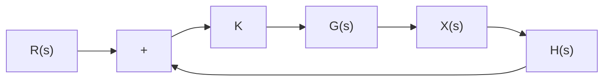

# 8.1 根轨迹的研究目标与方法

图 8.1.1(a) 所示的是一个标准的单位反馈闭环控制系统框图。其中含有一个增益 K，系统的开环传递函数是 G(s)，其对应的简化后的闭环控制系统框图如图 8.1.1(b) 所示（这是一个比例控制系统），闭环传递函数是 $G_{\mathrm{cl}}(s)=\frac{KG(s)}{1+KG(s)}$ 。根轨迹 (Root Locus) 研究的是当比例增益 K 从 0 到 +∞ 变化的时候，闭环控制系统传递函数特征方程的根（闭环传递函数 $G_{\mathrm{cl}}(s)=\frac{KG(s)}{1+KG(s)}$ 的极点，即 $1+KG(s)=0$ 时的 s 值）在复平面中位置的变化规律。

flowchart

(a) 单位反馈闭环控制系统框图

  
(b) 简化后的闭环控制系统框图  
图 8.1.1 根轨迹研究对象：单位反馈闭环控制系统

根轨迹研究的目标是闭环传递函数 $G_{\mathrm{cl}}(s)$ 极点的变化规律，而它的研究方法则是通过分析系统的开环传递函数 $G(s)$ 实现的。因此在使用根轨迹分析系统的时候，首先需要找到闭环传递函数分母部分为 $1 + KG(s)$ 中的 $G(s)$ 后再进行处理。

请看下面的两个例子。

例8.1.1 已知系统的闭环传递函数 $G_{\mathrm{cl}}(s) = \frac{Ks}{s^3 + 3s^2 + Ks + 1}$ ，将其转化为单位反馈形式并求其开环传递函数 $G(s)$ 。

解：单位反馈系统闭环传递函数的标准形式为

$$
G _ {\mathrm{cl}} (s) = \frac {K G (s)}{1 + K G (s)} \tag {8.1.1a}
$$

将 $G_{\mathrm{cl}}(s) = \frac{Ks}{s^3 + 3s^2 + Ks + 1}$ 代入式(8.1.1a)，可得

$$
\begin{array}{l} \frac {K s}{s ^ {3} + 3 s ^ {2} + K s + 1} = \frac {K G (s)}{1 + K G (s)} \\ \Rightarrow K s (1 + K G (s)) = \left(s ^ {3} + 3 s ^ {2} + K s + 1\right) K G (s) \\ \Rightarrow K s = \left(s ^ {3} + 3 s ^ {2} + 1\right) K G (s) \\ \Rightarrow G (s) = \frac {s}{s ^ {3} + 3 s ^ {2} + 1} \tag {8.1.1b} \\ \end{array}
$$

若要研究 $G_{\mathrm{cl}}(s) = \frac{Ks}{s^3 + 3s^2 + Ks + 1}$ 的极点随 $K$ 的变化，就要从 $G(s) = \frac{s}{s^3 + 3s^2 + 1}$ 入手分析。系统的简化框图与单位反馈闭环控制系统框图如图8.1.2所示。

  
(a) 闭环控制系统简化框图

flowchart

(b) 单位反馈闭环控制系统框图  
图8.1.2 例8.1.1图示

例 8.1.2 如图 8.1.3 所示的非单位反馈闭环控制系统应如何分析其根轨迹？

解：根据传递函数的代数性质，可得

$$
\begin{array}{l} X (s) = (R (s) - H (s) X (s)) K G (s) \\ \Rightarrow (1 + H (s) K G (s)) X (s) = R (s) K G (s) \\ \Rightarrow X (s) = \frac {R (s) K G (s)}{1 + H (s) K G (s)} \tag {8.1.2} \\ \end{array}
$$

其闭环传递函数分母部分为 $1+H(s)KG(s)$ ，因此需要通过 $G(s)H(s)$ 进行根轨迹分析。

flowchart

图 8.1.3 非单位反馈闭环控制系统框图
