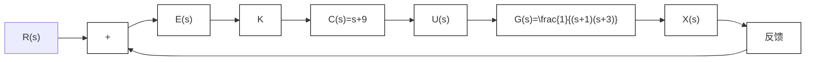

图 8.4.4 加入控制器 C(s) 后的系统框图

式(8.4.5b)描述了一个比例微分(Proportional Derivative, PD)控制器。

加入控制器后, 控制系统的开环传递函数为 $C(s)G(s)$ 。闭环传递函数 $G_{\mathrm{cl}}(s) = \frac{KC(s)G(s)}{1 + KC(s)G(s)}$ 的根轨迹如图8.4.5所示。正如我们所设计的, 根轨迹过目标点 $s = -3 \pm 2\sqrt{3}j$ 。同时, 图8.4.5说明随着 $K$ 的增加, $G_{\mathrm{cl}}(s)$ 的极点会继续向左移动, 其收敛速度仍有提高的空间。

text_image

-3+2\u221a3j
-9
-2
-1
O
σ
-jω
-3-2\u221a3j

图 8.4.5 加入控制器 C(s) 后的闭环传递函数根轨迹
