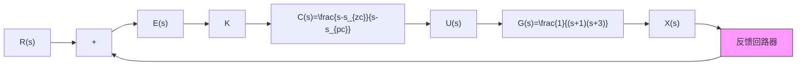
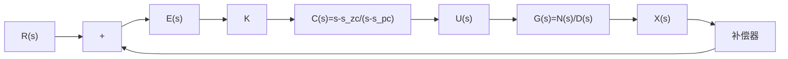

# 8.4.3 滞后补偿器

一个含有补偿器的反馈闭环控制系统标准形式如图8.4.8所示。其误差 $E(s)$ 可以表达为

$$
E (s) = R (s) - X (s) = R (s) - E (s) C (s) K G (s)
$$

$$
\Rightarrow E (s) = \frac {R (s)}{1 + C (s) K G (s)} \tag {8.4.8}
$$

flowchart

(a) 超前补偿器控制系统框图

text_image

渐近线
jω
sₚ₂
-3
sₚ₁
-1
O
σ
sₚc
s_zc

(b) 加入超前补偿器后的根轨迹

图 8.4.7 超前补偿器框图和根轨迹  

flowchart

图 8.4.8 含有补偿器的反馈闭环控制系统

在参考值 $r(t) = 1$ （单位阶跃，其拉普拉斯变换为 $R(s) = \frac{1}{s}$ ）的作用下，将 $C(s) = \frac{s - s_{\mathrm{zc}}}{s - s_{\mathrm{pc}}}$ 和 $G(s) = \frac{N(s)}{D(s)}$ 代入式(8.4.8)，可得

$$
E (s) = \frac {\frac {1}{s}}{1 + \frac {s - s _ {\mathrm{zc}}}{s - s _ {\mathrm{pc}}} K \frac {N (s)}{D (s)}} \tag {8.4.9}
$$

对式 $(8.4.9)$ 使用终值定理,得到

$$
\begin{array}{l} e _ {\mathrm{ss}} = \lim _ {t \rightarrow \infty} e (t) = \lim _ {s \rightarrow 0} s E (s) = \lim _ {s \rightarrow 0} \frac {\frac {1}{s}}{1 + \frac {s - s _ {\mathrm{zc}}}{s - s _ {\mathrm{pc}}} K \frac {N (s)}{D (s)}} \\ = \lim _ {s \rightarrow 0} \frac {1}{1 + \frac {s - s _ {\mathrm{zc}}}{s - s _ {\mathrm{pc}}} K \frac {N (s)}{D (s)}} = \frac {1}{1 + \frac {- s _ {\mathrm{zc}}}{- s _ {\mathrm{pc}}} K \frac {N (0)}{D (0)}} \\ = \frac {D (0)}{D (0) + K N (0) \frac {s _ {\mathrm{zc}}}{s _ {\mathrm{pc}}}} \tag {8.4.10} \\ \end{array}
$$

式(8.4.10)说明 $\frac{s_{zc}}{s_{pc}}$ 越大, $e_{ss}$ 就越小。因此设计补偿器 $C(s)$ 中的 $s_{zc}<s_{pc}<0$ , 便可以达到缩小稳态误差 $e_{ss}$ 的目标。此时, 补偿器的极点 $s_{pc}$ 在复平面上的位置比零点 $s_{zc}$ 更靠近虚轴, 这与 8.4.2 节介绍的超前补偿器相反, 称为滞后补偿器(Lag Compensator)(在 9.5.2 节将说明超前和滞后的命名原因)。
