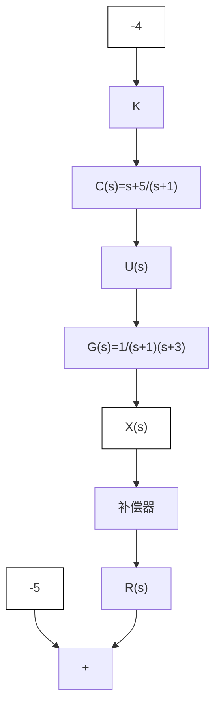

分析式(8.4.10)，可发现当 $\frac{s_{zc}}{s_{pc}}=\infty$ 时， $e_{ss}=0$ 。此时， $s_{pc}=0\Rightarrow C(s)=\frac{s-s_{zc}}{s}=1-\frac{s_{zc}}{s}$ ，这便是7.3节中所介绍的比例积分控制器。

考虑控制系统的开环传递函数为 $G(s)=\frac{1}{(s+1)(s+3)}$ ，在不使用补偿器的情况下（即 $C(s)=1$ 时），计算 K=2 时图 8.4.8 所示系统的稳态误差（请读者自行计算），可得

$$
e _ {\mathrm{ss}} = \frac {1}{1 + K G (0)} = \frac {1}{1 + 2 \times \frac {1}{3}} = 0. 6 \tag {8.4.11}
$$

若要缩小 $e_{\mathrm{ss}}$ ，可以为系统串联一个滞后补偿器 $C(s) = \frac{s - s_{\mathrm{zc}}}{s - s_{\mathrm{pc}}}$ 。当 $K = 2$ 时，将 $G(s) = \frac{1}{(s + 1)(s + 3)}$ 代入式(8.4.10)，可得

$$
e _ {\mathrm{ss}} = \frac {D (0)}{D (0) + K N (0) \frac {s _ {\mathrm{zc}}}{s _ {\mathrm{pc}}}} = \frac {(0 + 1) (0 + 3)}{(0 + 1) (0 + 3) + K \frac {s _ {\mathrm{zc}}}{s _ {\mathrm{pc}}}} = \frac {3}{3 + 2 \frac {s _ {\mathrm{zc}}}{s _ {\mathrm{pc}}}} \tag {8.4.12}
$$

当选择 $\frac{s_{\mathrm{zc}}}{s_{\mathrm{pc}}} = 5$ 时，系统的稳态误差将缩小到 $e_{\mathrm{ss}} = \frac{3}{13} = 0.23$ 。此时可以有不同的选择，例如： $C_1(s) = \frac{s + 5}{s + 1}$ ，此时 $\left\{ \begin{array}{l} s_{\mathrm{zc}} = -5 \\ s_{\mathrm{pc}} = -1 \end{array} \right.$ ；或者 $C_2(s) = \frac{s + 0.5}{s + 0.1}$ ，此时 $\left\{ \begin{array}{l} s_{\mathrm{zc}} = -0.5 \\ s_{\mathrm{pc}} = -0.1 \end{array} \right.$ 。根据式(8.4.12)，这两种选择都可以将稳态误差缩小到0.23。它们各自所对应的控制系统框图与根轨迹如图8.4.9所示。在实践中，一般会选择 $C_2(s) = \frac{s + 0.5}{s + 0.1}$ ，虽然这两个补偿器新增加的极点与零点都是相差了5倍，但是 $C_2(s)$ 中的极点/原点距离虚轴更近。对比图8.4.9(b)与图8.4.2，可以发现它和原系统的根轨迹图非常相似（仅仅增加了一条从 $s_{\mathrm{pc}} = -0.1$ 指向 $s_{\mathrm{zc}} = -0.5$ 的分支）。而使用了 $C_1(s) = \frac{s + 5}{s + 1}$ 后，根轨迹形状发生了较大的改变。

图 8.4.10 显示了在单位阶跃输入作用下, 不使用补偿器、使用补偿器 $C_{1}(s)$ 及使用补偿器 $C_{2}(s)$ 下的系统输出 $x(t)$ 随时间的变化。当使用滞后补偿器 $(C_{1}(s)$ 或 $C_{2}(s))$ 之后, 系统输出 $x(t)$ 的稳态误差从 0.6 下降至 0.23。同时可以看出, 使用 $C_{2}(s)=\frac{s+0.5}{s+0.1}$ 的系统输出在开始阶段的表现与原系统保持一致。之后补偿器会“慢慢”地修正稳态误差。而使用了 $C_{1}(s)=\frac{s+5}{s+1}$ 的系统输出则有完全不同的表现。

flowchart

(a) 增加补偿器 $C_{1}(s)=\frac{s+5}{s+1}$ 后的系统框图与根轨迹
