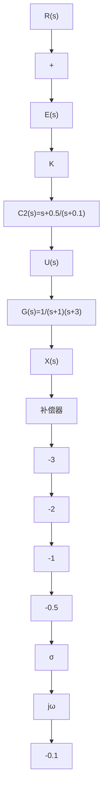

flowchart

```mermaid
graph TD
    A["R(s)"] --> B["+"]
    B --> C["E(s)"]
    C --> D["K"]
    D --> E["C2(s)=s+0.5/(s+0.1)"]
    E --> F["U(s)"]
    F --> G["G(s)=1/(s+1)(s+3)"]
    G --> H["X(s)"]
    H --> I["补偿器"]
    I --> J["-3"]
    J --> K["-2"]
    K --> L["-1"]
    L --> M["-0.5"]
    M --> N["σ"]
    N --> O["jω"]
    O --> P["-0.1"]
```

(b) 增加补偿器 $C_{2}(s)=\frac{s+0.5}{s+0.1}$ 后的系统框图与根轨迹

图 8.4.9 不同滞后补偿器框图及其所对应的根轨迹  
  
图 8.4.10 不同滞后补偿器所对应的系统输出

滞后补偿器内容请扫描此二维码观看。
