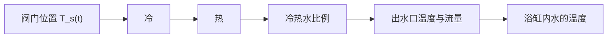
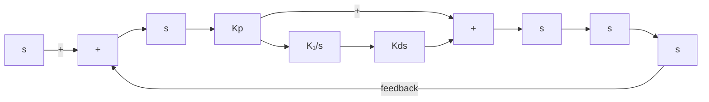

# 8.5 比例积分微分(PID)控制器

本书的7.3节介绍了比例积分控制器，8.4.1节介绍了比例微分控制。将它们二者结合在一起就形成了控制领域中著名的比例积分微分(PID)控制器。PID控制器是非常符合人类直觉的控制方法。它的发现来自对水手掌舵的观察，人们发现水手在控制船舶时不只是依赖目前的误差，也会考虑过去的误差以及误差的变化趋势。相信各位读者在生活中会不自觉地使用到这种控制方法来做事情。如图8.5.1所示，在浴缸中放洗澡水的时候，通过控制一个旋钮来控制出水口的温度，从而控制浴缸里面水的温度。

flowchart

图 8.5.1 PID 控制举例——浴缸水温控制

控制系统的控制量是旋钮的角度 $u(t) = \varphi(t)$ , 系统的输出为浴缸中的水温 $x(t) = T_w(t)$ 。控制的目标则是把水温稳定到一个舒服的温度, 即参考值 $r(t)$ 。参考值减去实际水温得到误差 $e(t), e(t) = r(t) - x(t)$ 。图 8.5.1 说明控制量与输出之间存在着很多的中间过程, 包含了复杂的物理变化: 旋钮改变阀门的位置, 从而改变冷热水的比例, 而冷热水的比例决定了出水口的温度与流量, 新注入浴缸的水与浴缸内已有的水混合之后才是最终的输出。如果对这一过程进行数学建模, 就要包含动力学和热力学的模型。请读者思考一下自己在洗澡的时候, 是否考虑过这些中间过程? 我相信是没有的, 相反, 我们会通过一种直观的控制方式来完成水温的调节, 即

$$
u (t) = u _ {\mathrm{p}} (t) + u _ {\mathrm{I}} (t) + u _ {\mathrm{D}} (t) = K _ {\mathrm{P}} e (t) + K _ {\mathrm{I}} \int e (t) \mathrm{d} t + K _ {\mathrm{D}} \frac {\mathrm{d} e (t)}{\mathrm{d} t} \tag {8.5.1}
$$

式(8.5.1)意味着,在调节旋钮控制水温的时候会综合考虑“当前”的误差(比例控制 $u_{\mathrm{p}}(t)=K_{\mathrm{p}}e(t)$ )、“过去”误差的积累(积分控制 $u_{\mathrm{I}}(t)=K_{\mathrm{I}}\int e(t)\mathrm{d}t$ ),以及“未来”误差的变化趋势(微分控制 $u_{\mathrm{D}}(t)=K_{\mathrm{D}}\frac{\mathrm{d}e(t)}{\mathrm{d}t}$ )。在7.3.3节中,我们详细分析了比例积分控制如何降低甚至消除系统的稳态误差,在8.4.1节中则论证了使用比例微分控制可以提高系统的响应速度。因此,式(8.5.1)所示的比例积分微分(PID)控制器将兼具两者的优点,既可以提高系统的响应速度,也可以消除稳态误差。更为关键的是,即使不清楚动态系统的内部结构以及输入和输出的关系(例如上述的例子中,没有人清楚地知道旋钮与水温的关系),大部分情况下,我们依然可以使用PID控制系统达到满意的结果。

式(8.5.1)所对应的拉普拉斯变换为

$$
U (s) = \left(K _ {\mathrm{P}} + K _ {\mathrm{I}} \frac {1}{s} + K _ {\mathrm{D}} s\right) E (s) \tag {8.5.2}
$$

其系统框图如图 8.5.2 所示。

flowchart

图8.5.2 PID控制框图
