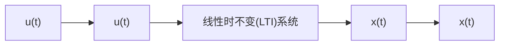

# 9.2 频率特性推导

如图 9.2.1 所示, 当正弦输入 $u(t)$ 通过一个线性时不变系统之后, 在稳定的状态下, 系统的输出 $x(t)$ 也是正弦函数。而且 $x(t)$ 的频率与 $u(t)$ 相同, 但是振幅和相位发生了改变。下面将详细推导这一性质, 并求解振幅与相位的变化规律。

flowchart

图 9.2.1 正弦信号通过线性时不变系统

首先从正弦输入的一般形式入手,它可以表达为

$$
u (t) = A \sin (\omega_ {\mathrm{i}} t) + B \cos (\omega_ {\mathrm{i}} t) \tag {9.2.1}
$$

其中， $\omega_{i}$ 是输入频率（下标 i 代表 Input）， $A$ 和 $B$ 是两个常数。如果将 $A$ 和 $B$ 作为三角形的两个直角边，可以得到图 9.2.2 中的几何关系，定义输入相位为

$$
\varphi_ {\mathrm{i}} = \arctan \frac {B}{A} \tag {9.2.2a}
$$

输入振幅为

$$
M _ {\mathrm{i}} = \sqrt {A ^ {2} + B ^ {2}} \tag {9.2.2b}
$$

调整式(9.2.1)，可得

text_image

φ₁=arctanB/A
M₁=√(A²+B²)
A
B

图9.2.2 正弦函数输入的几何表达

$$
\begin{array}{l} u (t) = \sqrt {A ^ {2} + B ^ {2}} \left(\frac {A}{\sqrt {A ^ {2} + B ^ {2}}} \sin (\omega_ {\mathrm{i}} t) + \frac {B}{\sqrt {A ^ {2} + B ^ {2}}} \cos (\omega_ {\mathrm{i}} t)\right) \\ = \sqrt {A ^ {2} + B ^ {2}} (\cos \varphi_ {\mathrm{i}} \sin (\omega_ {\mathrm{i}} t) + \sin \varphi_ {\mathrm{i}} \cos (\omega_ {\mathrm{i}} t)) \\ = M _ {\mathrm{i}} \sin (\omega_ {\mathrm{i}} t + \varphi_ {\mathrm{i}}) \tag {9.2.3} \\ \end{array}
$$

  
图 9.2.3 频率响应框图

式(9.2.3)中,正弦输入的振幅为 $M_{i}$ ,频率为 $\omega_{i}$ ,相位为 $\varphi_{i}$ 。考虑将其施加到一个线性时不变系统 $G(s)$ 中,如图9.2.3所示。

根据式(9.2.1)，正弦输入的拉普拉斯变换 $U(s)$ 为

$$
\begin{array}{l} U (s) = \mathcal {L} [ u (t) ] = \mathcal {L} [ A \sin (\omega_ {\mathrm{i}} t) + B \cos (\omega_ {\mathrm{i}} t) ] \\ = \mathcal {L} [ A \sin (\omega_ {\mathrm{i}} t) ] + \mathcal {L} [ B \cos (\omega_ {\mathrm{i}} t) ] \\ = \frac {A \omega_ {\mathrm{i}}}{s ^ {2} + \omega_ {\mathrm{i}} ^ {2}} + \frac {B s}{s ^ {2} + \omega_ {\mathrm{i}} ^ {2}} = \frac {A \omega_ {\mathrm{i}} + B s}{s ^ {2} + \omega_ {\mathrm{i}} ^ {2}} = \frac {A \omega_ {\mathrm{i}} + B s}{(s + \mathrm{j} \omega_ {\mathrm{i}}) (s - \mathrm{j} \omega_ {\mathrm{i}})} \tag {9.2.4} \\ \end{array}
$$

传递函数 $G(s)$ 可以表达为
