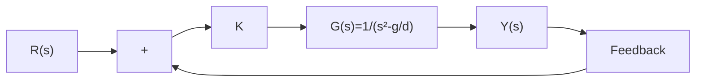
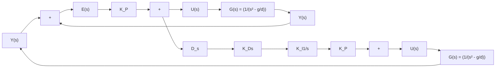

# 10.1.2 PID控制方案

将式(10.1.7)考虑为一个动态系统,定义其输入 $u(t)=\frac{-1}{d}\frac{\mathrm{d}^{2}\xi(t)}{\mathrm{d}t^{2}}$ , 其中, $\frac{\mathrm{d}^{2}\xi(t)}{\mathrm{d}t^{2}}$ 的物

理意义是手指沿 $x_{1}$ 方向的加速度，乘以 $\frac{-1}{d}$ 的意义是将其单位化。系统的输出则定义为连杆的角度 $y(t) = \phi (t)$ 。式(10.1.7)可以写成

$$
\frac {\mathrm{d} ^ {2} y (t)}{\mathrm{d} t ^ {2}} - \frac {g}{d} y (t) = u (t) \tag {10.1.8}
$$

将式(10.1.8)等号两边进行拉普拉斯变换,考虑零初始状态,得到动态系统的传递函数为

$$
\left(s ^ {2} - \frac {g}{d}\right) Y (s) = U (s)
$$

$$
\Rightarrow G (s) = \frac {Y (s)}{U (s)} = \frac {1}{s ^ {2} - \frac {g}{d}} \tag {10.1.9}
$$

在此基础上设计控制方案,使用第8章所介绍的根轨迹设计方法,首先建立一个单位反馈闭环控制系统,如图10.1.2(a)所示,其根轨迹如图10.1.2(b)所示。闭环传递函数的极点随着K的增加将沿着实轴相向移动,在虚轴汇合后指向无穷,成为两个共轭的纯虚数。这意味着无论增益K如何增大,都无法使系统稳定。因此,若为保障系统稳定,则需要在复平面虚轴左边增加零点,使得根轨迹的渐近线向左边移动。同时,系统也需要增加极点以消除系统的稳态误差,因此可以使用PID控制器,如图10.1.2(c)所示。

flowchart

(a) 单位反馈闭环控制系统框图

text_image

jω
-√g/d O √g/d σ

(b) 闭环传递函数根轨迹

flowchart

(c) PID控制框图  
图 10.1.2 使用传递函数方法来控制系统

有兴趣的读者可以尝试使用模拟软件搭建此系统并调节PID控制器的参数来分析系统的表现。你会发现参数的调节过程非常困难，很难得到满意的系统表现。这是因为开环传递函数 $G(s)$ 本身含有一个正数极点 $\sqrt{g / d}$ ，这就决定了无论如何去增加极点/零点，闭环传递函数的根轨迹总会有一条分支从 $s_{\mathrm{p1}}$ 出发向着零点或者无穷移动。这意味着需要足够大的增益 K 才能使其移动到复平面的左半部分, 而过高的增益会带来强烈的振荡和过高的超调量。并且当增益过大的时候, 系统的控制量 $u(t)$ 也会变得很大, 造成不必要的能量损耗。

上述问题体现了 PID 控制器的局限性, 观察图 10.1.2(c) 可知, 控制量 $U(s)$ 是误差 $E(s)$ 的函数, 而误差 $E(s) = Y(s) - R(s)$ 。这说明在设计控制器时只考虑了系统的输出 $Y(s)$ , 虽然足够简单, 但是并没有提供全部的系统状态信息, 因此灵活性不够。本章后面的内容将讨论使用状态空间方程设计控制器的方法, 它可以有效提高控制器设计的灵活性, 改善系统表现。
