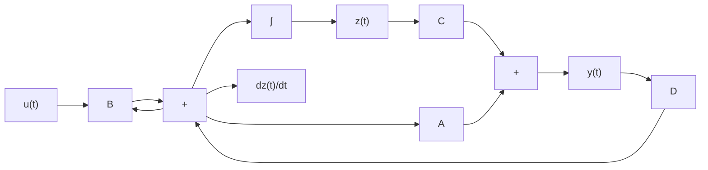

# 10.1.3 状态空间方程建模

根据第3章的介绍,可以将式(10.1.7)的微分方程写成状态空间方程,首先选取两个状态变量 $z_{1}(t)$ 和 $z_{2}(t)$ ,令

$$
z _ {1} (t) = \phi (t) \tag {10.1.10}
$$

$$
z _ {2} (t) = \frac {\mathrm{d} z _ {1} (t)}{\mathrm{d} t} = \frac {\mathrm{d} \phi (t)}{\mathrm{d} t} \tag {10.1.11}
$$

取 $z_{2}(t)$ 对时间的导数，并将 $u(t) = -\frac{1}{d}\frac{\mathrm{d}^2\xi(t)}{\mathrm{d}t^2}$ 和式(10.1.7)代入其中，可得

$$
\frac {\mathrm{d} z _ {2} (t)}{\mathrm{d} t} = \frac {\mathrm{d} ^ {2} \phi (t)}{\mathrm{d} t ^ {2}} = \frac {g}{d} \phi (t) + u (t) \tag {10.1.12}
$$

把式(10.1.10)和式(10.1.12)写成一个紧凑的矩阵表达形式,可得

$$
\frac {\mathrm{d} \pmb {z} (t)}{\mathrm{d} t} = \pmb {A} \pmb {z} (t) + \pmb {B} \pmb {u} (t), \quad \text {其中}, \pmb {A} = \left[ \begin{array}{l l} 0 & 1 \\ \frac {g}{d} & 0 \end{array} \right], \pmb {B} = \left[ \begin{array}{l} 0 \\ 1 \end{array} \right] \tag {10.1.13}
$$

系统的输出 $y(t)=\phi(t)$ 也可以写成矩阵形式，即

$$
\mathbf {y} (t) = \mathbf {C} \left[ \begin{array}{l} z _ {1} (t) \\ z _ {2} (t) \end{array} \right] + \mathbf {D u} (t), \quad \text {其中}, \mathbf {C} = \left[ \begin{array}{l l} 1 & 0 \end{array} \right], \mathbf {D} = [ 0 ] \tag {10.1.14}
$$

式(10.1.13)和式(10.1.14)构成了动态系统的状态空间方程。图 10.1.3 使用框图描述了一个标准的状态空间方程表达式。我们将以此为基础来设计控制器。

flowchart

图 10.1.3 状态空间方程的系统框图

线性状态反馈控制器—系统建模内容请扫描此二维码观看。

