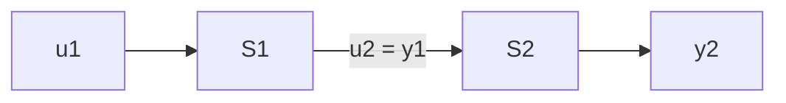

# 1.3.4 分析定常线性系统

$$
\left\{ \begin{array}{l} \dot {x} (t) = \left[ \begin{array}{c c c} - 2 & 2 & - 1 \\ 0 & - 2 & 0 \\ 1 & - 4 & 0 \end{array} \right] x (t) [ 0 \quad 0 \quad 1 ] u (t) \\ y (t) = [ 1 - 1 \quad 1 ] x (t) \end{array} \right.
$$

的能控性、能观测性，并求出传递函数.

1.3.5 设 $A, B, C$ 分别为 $n \times n, n \times r$ 和 $m \times n$ 实矩阵， $I$ 为 $n \times n$ 单位矩阵.

(a) 如果 $(A, B)$ 是能控的， $K_{1} \in \mathbb{R}^{n \times n}$ 为半正定阵， $D_{1} \in \mathbb{R}^{n \times r}$ 满足 $BB^{\mathrm{T}} + K = D_{1}D_{1}^{\mathrm{T}}$ ，那么 $(A, D_{1})$ 是否是能控的？若是，请证明之。若不是，请举例说明：

(b) 如果 $(A, C)$ 是能观测的， $K_{2} \in \mathbb{R}^{n \times n}$ 为半正定阵， $D_{2} \in \mathbb{R}^{m \times n}$ 满足 $C^{\mathrm{T}}C + K = D_{2}^{\mathrm{T}}D_{2}$ ，那么 $(A, D_{2})$ 是否能观测？若是，请证明之。若不是，请举例说明。

1.3.6 对给定定常线性系统 $(A, B, C)$ , 假设 $\operatorname{rank} B = r$ , $\operatorname{rank} C = m$ , 证明

$$
\operatorname{rank} Q _ {c} = \operatorname{rank} [ B, A B, \dots , A ^ {n - r} B ],
\operatorname{rank} \boldsymbol {Q} _ {\circ} = \operatorname{rank} \left[ \begin{array}{c} \boldsymbol {C} \\ \boldsymbol {C A} \\ \vdots \\ \boldsymbol {C A} ^ {n - m} \end{array} \right].
$$

1.3.7 已知自然数 $n$ 及实数 $a_{i}, b_{i} (i = 1, \dots, n)$ . 记

$$
\boldsymbol {A} = \left[ \begin{array}{c c c c c} 0 & 0 & \dots & 0 & - a _ {n} \\ 1 & 0 & \ddots & \vdots & - a _ {n - 1} \\ 0 & 1 & \ddots & 0 & \vdots \\ \vdots & \ddots & \ddots & 0 & - a _ {2} \\ 0 & \dots & 0 & 1 & - a _ {1} \end{array} \right], \quad \boldsymbol {B} = \left[ \begin{array}{c} b _ {n} \\ b _ {n - 1} \\ \vdots \\ b _ {2} \\ b _ {1} \end{array} \right],
$$

证明： $(A,B)$ 能控的充分必要条件是多项式 $s^{n}+a_{1}s^{n-1}+\cdots+a_{n}$ 与 $b_{1}s^{n-1}+\cdots+b_{n}$ 互质.

1.3.8 已知如下两个能控能观单输入、单输出系统 $S_{1}$ 和 $S_{2}$ :

$$
S _ {1}: \quad \left\{ \begin{array}{l} \dot {x} _ {1} = A _ {1} x _ {1} + B _ {1} u _ {1}, \\ y _ {1} = C _ {1} x _ {1}; \end{array} \right. \quad S _ {2}: \quad \left\{ \begin{array}{l} \dot {x} _ {2} = A _ {2} x _ {2} + B _ {2} u _ {2}, \\ y _ {2} = C _ {2} x _ {2}; \end{array} \right.
$$

其中

$$
\begin{array}{l} \pmb {A} _ {1} = \left[ \begin{array}{c c} 0 & 1 \\ - 3 & - 4 \end{array} \right], \quad \pmb {B} _ {1} = \left[ \begin{array}{c} 0 \\ 1 \end{array} \right], \quad \pmb {C} _ {1} = [ 2 \quad 1 ], \\ A _ {2} = - 2, \quad B _ {2} = 1, \quad C _ {2} = 1. \\ \end{array}
$$

(a) 如果将系统 $S_{1}$ 和 $S_{2}$ 串联起来

flowchart

试求出 $x = \begin{bmatrix} x_1 \\ x_2 \end{bmatrix}$ 的状态方程；

(b) 分析串联系统 $S_{2}S_{1}$ 的能控能观测性;  
(c) 求出串联系统 $S_{2}S_{1}$ 的传递函数.
