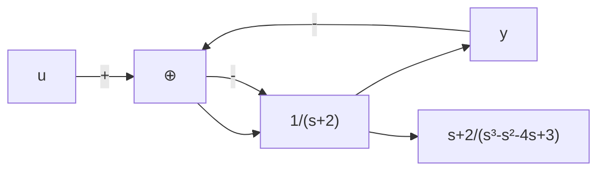

# 1.7.3 已知某系统的输出 $y$ 和输入 $u$ 的关系由如下框图确定：

flowchart

```mermaid
graph LR
    u -->|+| A["⊕"]
    A --> B["1/(s+2)"]
    B --> y
    y -->|-| A
    A -->|-| B
    B --> C["s+2/(s³-s²-4s+3)"]
```

(a) 求出该系统的输入输出传递函数;  
(b) 为该传递函数设计一个最小状态空间实现；  
(c) 为该最小实现设计一个最小阶状态观测器，使该观测器状态与系统状态之间的误差以不低于 $e^{-2t}$ 的速度收敛到零.
