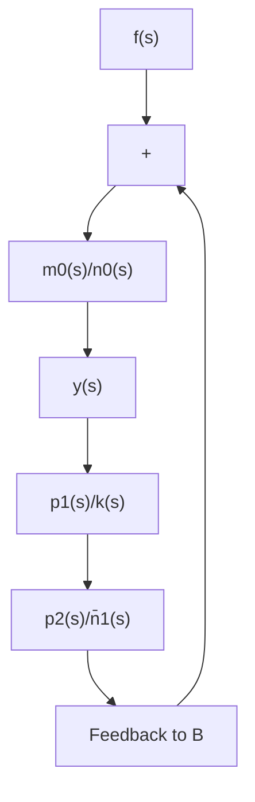

图1.8.1

它的主要作用是抵消外部干扰，称为伺服通道， $W_{11}(s)$ 叫做伺服补偿器的传递函数；另一个通道的传递函数为

$$W _ {1 2} (s) = \frac {p _ {2} (s)}{\bar {n} _ {1} (s)},$$

它的主要作用是保证闭环系统稳定，称为镇定通道， $W_{12}(s)$ 叫做镇定补偿器的传递函数。因此可以说，鲁棒系统靠伺服补偿抵消外部干扰，靠镇定补偿器稳定系统。所谓鲁棒系统是指带有鲁棒调节器的闭环系统。同时还可以看出，鲁棒系统是通过闭环系统传递函数的零点与外部干扰输入信号的极点之间的零极相消实现抵消外部干扰的。

现在我们讨论鲁棒调节器的存在性和设计方法. 给定开环系统 (1.8.42), 则它存在鲁棒调节器的充分必要条件是 $m_0(s)$ 与 $k(s)$ 互质. 事实上, 若动态补偿器 (1.8.43) 是系统 (1.8.42) 的一个鲁棒调节器, 那么从 (1.8.44) 可以看出, $m_0(s)$ 与 $k(s)$ 必互质. 否则, 因为 $k(s)$ 是 $n_1(s)$ 的因子, 所以 $n_0(s)n_1(s)+m_0(s)m_1(s)$ 必与 $k(s)$ 有非常数公因子. 这与 $n_0(s)n_1(s)+m_0(s)m_1(s)$ 是稳定的多项式矛盾. 反之, 若 $m_0(s)$ 与 $k(s)$ 互质, 则可以为系统 (1.8.42) 设计一个鲁棒调节器. 这说明开环系统 (1.8.42) 存在鲁棒调节器. 设计方法可分以下两步进行. 在设计过程中, 暂时假设 $f(s)=0$ .

第一步：设计伺服补偿器.

取补偿器的传递函数为

$$W _ {1 1} (s) = \frac {p _ {1} (s)}{k (s)},$$

其中 $p_1(s)$ 与 $k(s)$ 互质， $\deg (p_1(s)) < \deg (k(s))$

第二步：设计镇定补偿器.

取控制规律为

$$u (s) = u _ {c} (s) - W _ {1 1} (s) y (s),$$

其中 $u_{c}(s)$ 为待定的控制输入．将这个控制规律代入系统(1.8.42)得

$$y (s) = \frac {m _ {0} (s)}{n _ {0} (s)} u _ {c} (s) - \frac {m _ {0} (s) p _ {1} (s)}{n _ {0} (s) k (s)} y (s).$$

于是

$$y (s) = \frac {m _ {0} (s) k (s)}{n _ {0} (s) k (s) + m _ {0} (s) p _ {1} (s)} u _ {c} (s). \tag {1.8.48}$$

由于 $n_0(s)$ 与 $m_0(s)$ 互质， $k(s)$ 与 $p_1(s)$ 互质，因此 $n_0(s)k(s) + m_0(s)p_1(s)$ 与 $m_0(s)k(s)$ 互质。任给次数不小于 $n_0(s)k(s)$ 的稳定多项式 $n(s)$ ，总存在多项式 $\bar{n}_1(s)$ 和 $p_2(s)$ 使得

$$n (s) = \bar {n} _ {1} (s) [ n _ {0} (s) k (s) + m _ {0} (s) p _ {1} (s) ] + p _ {2} (s) m _ {0} (s) k (s),$$

且 $\deg (n(s)) = \deg (n_0(s)n_1(s)k(s)),\deg (\bar{n}_1(s)) > \deg (p_2(s)).$

取动态补偿器

$$u _ {c} (s) = - \frac {p _ {2} (s)}{\bar {n} _ {1} (s)} y (s), \tag {1.8.49}$$

并将它代入式 (1.8.48) 得 $n(s)y(s) = 0$ . 这说明 $n(s)$ 是闭环系统的特征多项式。由于它是稳定的，可见动态补偿器 (1.8.49) 的确保证了闭环系统的稳定性，所以它是镇定补偿器。最后取

$$u (s) = - \frac {m _ {1} (s)}{n _ {1} (s)} y (s), \tag {1.8.50}$$

其中 $n_1(s) = \bar{n}_1(s)k(s), m_1(s) = p_1(s)\bar{n}_1(s) + p_2(s)k(s)$ ，则式 (1.8.50) 就是所要求的鲁棒调节器。

可以看出，当系统的外部干扰信号为常值时，则 $k(s) = s$ ，即在鲁棒系统中必包含一个积分器，它的作用就是消除常值阶跃干扰对系统的影响.

这里只从传递函数的观点出发描述了单输入-单输出系统的内模原理，分析了鲁棒调节器的结构性质，给出了它的存在条件和设计方法。对多输入多输出系统的内模原理，有兴趣的读者可进一步参阅文献[14],[15]等.
