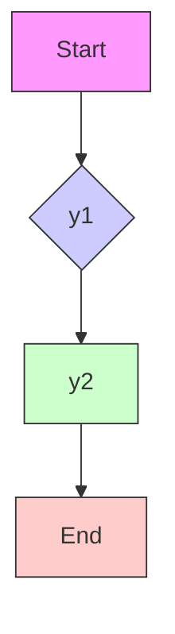

$$
y (t; y _ {0}) = \left[ \begin{array}{c c} \mathrm{e} ^ {\lambda_ {1} t} & 0 \\ 0 & \mathrm{e} ^ {\lambda_ {2} t} \end{array} \right] y _ {0}, \quad y _ {0} = S x _ {0}. \tag {2.5.5}
$$

从关系式 (2.5.5) 得出：当 $t \to +\infty$ 时，微分方程 (2.5.4) 的一切非零轨线都趋于它的奇点 $y = 0$ (原点); 除 $y_{1}$ 轴上的点外，微分方程 (2.5.4) 的以任何点为初态的轨线都与 $y_{2}$ 轴相切地趋于原点 $y = 0$ ; $y_{1}$ 轴和 $y_{2}$ 轴也都是微分方程 (2.5.4) 的轨线。当 $\lambda_{1}, \lambda_{2}$ 同为负时， $y = 0$ 称为微分方程 (2.5.4) 的稳定结点型奇点，这时微分方程 (2.5.4) 的轨线分布也称为稳定结点型的 (图 2.5.4).

当 $\lambda_1, \lambda_2$ 同为正，不妨认为 $\lambda_1 > \lambda_2 > 0$ 时，从式 (2.5.5) 不难得到：当 $t \to +\infty$ 时，微分方程 (2.5.4) 的一切非零轨线都离开原点而趋向无穷，而当 $t \to -\infty$ 时，微分方程 (2.5.4) 的一切非零轨线都趋向原点；除 $y_1$ 轴上点外，微分方程 (2.5.4) 的以任何点为初态的轨线当 $t \to -\infty$ 时都以 $y_2$ 轴为切线趋向原点； $y_1$ 轴和 $y_2$ 轴也都是微分方程 (2.5.4) 的轨线。当 $\lambda_1, \lambda_2$ 同为正时， $y = 0$ 称为微分方程 (2.5.4) 的不稳定结点型奇点。这时微分方程 (2.5.4) 的轨线的分布也称为不稳定结点型的（图 2.5.5）。

text_image

y₂
y₁

图2.5.4

text_image

y₂
y₁

图2.5.5

当 $\lambda_1, \lambda_2$ 异号，不妨认为 $\lambda_1 < 0 < \lambda_2$ 时，从式 (2.5.5) 不难得到：当 $t \to +\infty$ 时， $y_1(t; y_0) \to 0, y_2(t; y_0) \to +\infty (y_{20} > 0$ 时； $y_1$ 轴是微分方程 (2.5.4) 的轨线，并且 $y_1(t; y_0) = e^{\lambda_1 t} y_{10}, y_2(t; y_0) \equiv 0$ 。当 $t \to +\infty$ 时， $y_1$ 轴上的点向着原点靠近，最后趋向原点； $y_2$ 轴也是微分方程 (2.5.4) 的轨线，并且 $y_2(t; y_0) = e^{\lambda_2 t} y_{10}, y_1(t; y_0) \equiv 0$ 。当 $t \to +\infty$ 时， $y_2$ 轴上的点离开原点趋向无穷。当 $\lambda_1, \lambda_2$ 异号时， $y = 0$ 称为微分方程 (2.5.4) 的鞍点型奇点。相应的轨线的分布也称为鞍点型的 (图 2.5.6)。

flowchart

图2.5.6

(2) $A = \begin{bmatrix} \lambda & 0 \\ 0 & \lambda \end{bmatrix}$ , $\lambda$ 是矩阵 $A$ 的几何二重实特征值.

这时方程 (2.5.4) 的解 $y(t; y_0)$ 为

$$
y (t; y _ {0}) = \left[ \begin{array}{c c} \mathrm{e} ^ {\lambda t} & 0 \\ 0 & \mathrm{e} ^ {\lambda t} \end{array} \right] y _ {0}. \tag {2.5.6}
$$
