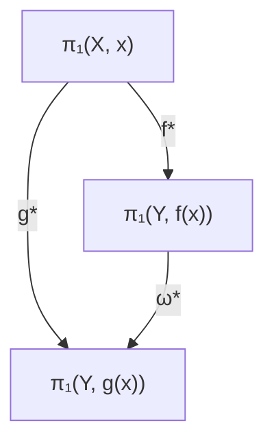

我们要证明： $(p_{*}\times q_{*}):\pi_{1}(X\times Y)\to \pi_{1}(X)\times \pi_{1}(Y)$ 是一个同构．对每一对 $[x(s)]\times [y(s)]\in \pi_1(X)\times \pi_1(Y)$ ，我们可以构造 $[x(s),y(s)]\in \pi_1(X\times Y)$ ，使得

$$(p _ {*} \times q _ {*}) ([ x (s) \times y (s) ]) = [ x (s) ] \times [ y (s) ] \in \pi_ {1} (X) \times \pi_ {1} (Y).$$

因此 $p_{*} \times q_{*}$ 是映上的.

今证明 $p_* \times q_*$ 也是一对一的。设 $\alpha_i = (x_i(s), y_i(s))$ , $i = 1, 2$ , 使得

$$(p _ {*} \times q _ {*}) ([ \alpha_ {1} ]) = (p _ {*} \times q _ {*}) ([ \alpha_ {2} ]),$$

要证 $[x_1] = [x_2]$ 且 $[y_1] = [y_2]$ ，即

$$x _ {1} (s) \sim x _ {2} (s), \quad y _ {1} (s) \sim y _ {2} (s).$$

设它们间的同伦映射分别为 $h_1(s, t)$ 及 $h_2(s, t)$ . 那么我们可以构造

$$H (s, t) = \left(h _ {1} (s, t), h _ {2} (s, t)\right).$$

容易检验这是 $\alpha_{1}$ 与 $\alpha_{2}$ 间的一个同伦，从而 $[\alpha_{1}] = [\alpha_{2}]$ . 因此 $p_{*} \times q_{*}$ 是一对一的.

例 3.4.3 考虑一个轮胎, 记作 $T^{2}$ . $T^{2} \cong S^{1} \times S^{1}$ . (更一般地 $T^{k} \cong \underbrace{S^{1} \times \cdots \times S^{1}}_{k}$ ) 根据上述命题:

$$\pi_ {1} (T ^ {2}) \cong \pi_ {1} (S ^ {1}) \times \pi_ {1} (S ^ {1}) \cong Z \times Z = Z ^ {2}.$$

下面，我们将证明一个重要事实，即基本群同伦不变。为此，我们需要一些准备。

引理3.4.5 设 $g, f$ 为 $X$ 到 $Y$ 的两个同伦的连续映射， $H(x, t)$ 为 $g$ 到 $f$ 的同伦。对于 $x \in X$ ，定义一路径

$$\omega = H (x, s), \quad s \in I = [ 0, 1 ].$$

那么图3.4.3是可交换的，即 $\omega_{*}\circ f_{*} = g_{*}$

flowchart

图3.4.3 $\omega_{*}$

证明 注意 $f_{*}, g_{*}$ 的定义不同于 $\omega_{*}$ , 它们的意义是不一样的. 设 $[\alpha] \in \pi_1(X, x)$ . 我们必须证明

$$g \circ \alpha \simeq_ {(\{0 \}, \{1 \})} \omega \circ (f \circ \alpha) \circ \omega^ {- 1}. \tag {3.4.9}$$

设 $H$ 是从 $g$ 到 $f$ 的同伦，令 $x = \alpha (r)$ 我们可得图3.4.4(a).

我们的目的是构造一个同伦使得图3.4.4成立. 在两条边: $t = 4s$ 及 $t = 4(1 - s)$ 上, 我们需要 $\omega(t)$ . 那么容易看出在左右两个三角形区域我们可以分别用 $\omega(4s)$ 及 $\omega(4 - 4s)$ . 在中间梯形区域, 我们只要将图3.4.4(a)用如下变形即可:

$$r = \frac {4 s - t}{4 - 2 t}.$$

归纳起来，我们就得到以下的同伦：

$$
\widetilde {H} (s, t) = \left\{ \begin{array}{l l} \omega (4 s), & 4 s \leqslant t, \\ H \left(\alpha \left(\frac {4 s - t}{4 - 2 t}, t\right)\right), & t \leqslant 4 s \leqslant 4 - t, \\ \omega (4 - 4 s), & 4 s \geqslant 4 - t. \end{array} \right. \tag {3.4.10}
$$

text_image

