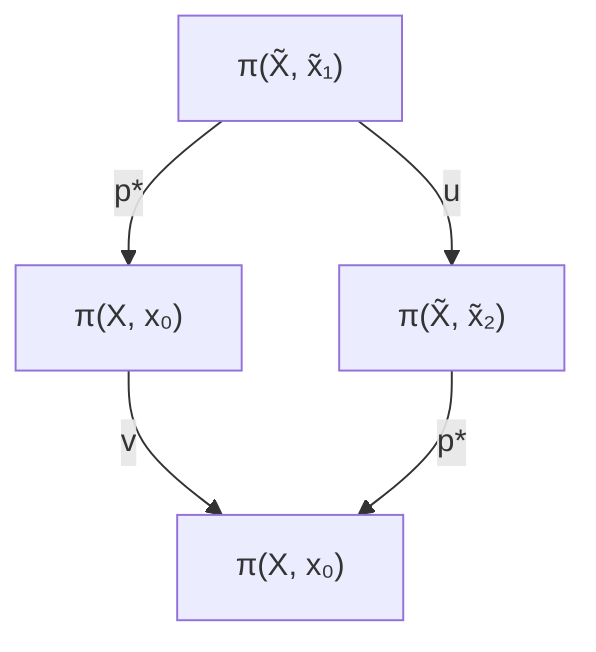

证明 回忆关于同态的例 3.4.2. 我们只要证明它是一对一的。设 $\widetilde{\alpha}, \widetilde{\beta}$ 为两个以 $\widetilde{x}_0$ 为基点的环路。设 $p_*([\widetilde{\alpha}) = p_*([\widetilde{\beta}])$ ，且记 $\alpha = p \circ \widetilde{\alpha}$ 及 $\beta = p \circ \widetilde{\beta}$ 。那么 $\alpha \sim \beta$ 。假定其同伦映射为 $h(s, t)$ ，即

$$h (s, 0) = \alpha (s), \quad h (s, 1) = \beta (s), \quad h (0, t) = x _ {0}.$$

由命题3.4.16, 存在唯一 $\tilde{h}(s, t)$ 使得

$$\widetilde {h} (0, 0) = \widetilde {x} _ {0}, \quad p \circ \widetilde {h} = h.$$

因为 $p \circ \widetilde{h}(s,0) = \alpha$ ，由命题3.4.15，

$$\widetilde {h} (s, 0) = \widetilde {\alpha} (s).$$

类似地，

$$\widetilde {h} (s, 1) = \widetilde {\beta} (s).$$

于是可得

$$\widetilde {\alpha} (s) \sim \widetilde {\beta} (s),$$

即 $[\widetilde{\alpha}(s)] = [\widetilde{\beta}(s)].$

直观地说，复叠空间将原空间扩大但简化了其拓扑结构。这是上述命题的意义所在。下面的定理指出提升的路径在不同基点形成同样的群：

定理3.4.4 设 $(\widetilde{X}, p)$ 为 $X$ 的复叠空间. 则

$$\{p _ {*} \pi (\widetilde {X}, \widetilde {x} _ {0}) \mid \widetilde {x} _ {0} \in p ^ {- 1} (x _ {0}) \}$$

是 $\pi(X, x_0)$ 的一族共轭群.

证明 设 $p(\tilde{x}_1) = p(\tilde{x}_2) = x_0, \gamma$ 为连接 $\tilde{x}_1$ 到 $\tilde{x}_2$ 的一个路径. 那么

$$p _ {*} ([ \gamma ]) = [ p \circ \gamma ] \in \pi (X, x _ {0}).$$

定义一个同构 $u: \pi(\widetilde{X}, \widetilde{x}_1) \to \pi(\widetilde{X}, \widetilde{x}_2)$ 如下：

$$u ([ \alpha ]) = [ \gamma ] ^ {- 1} [ \alpha ] [ \gamma ],$$

及一个同构 $v: \pi(X, x_0) \to \pi(X, x_0)$ 如下：

$$v ([ \beta ]) = (p _ {*} [ \gamma ]) ^ {- 1} [ \beta ] (p _ {*} [ \gamma ]).$$

容易证明图3.4.5是可交换的，即

$$p _ {*} \pi (\widetilde {X}, \widetilde {x} _ {2}) = [ p \circ \gamma ] ^ {- 1} [ p _ {*} \pi (\widetilde {X}, \widetilde {x} _ {1}) ] [ p \circ \gamma ].$$

flowchart

图3.4.5 道路同伦

最后我们给出一个复叠空间的存在性定理 (其证明参考文献 [13]). 我们需要一个新的概念：一个拓扑空间 $X$ 称为半局部单连通的，如果每一点 $x \in X$ 都有一个简单连通的邻域.

定理3.4.5 设 $X$ 为一拓扑空间，满足(1)路径连通；(2)局部连通；(3)半局部单连通．那么它有一个复叠空间，称为泛复叠空间 $(\tilde{X},p)$ ，满足

(1) 如果 $(\tilde{X}_1, p_1)$ 及 $(\tilde{X}_2, p_2)$ 为两个泛复叠空间，那么 $\tilde{X}_1$ 与 $\tilde{X}_2$ 同胚。此外，同胚映射 $f$ 使得图3.4.6(a)和(b)可交换。

flowchart

