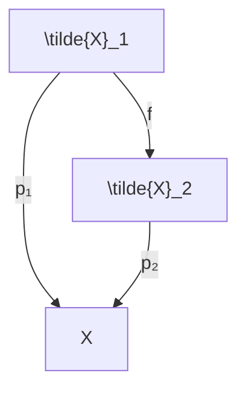
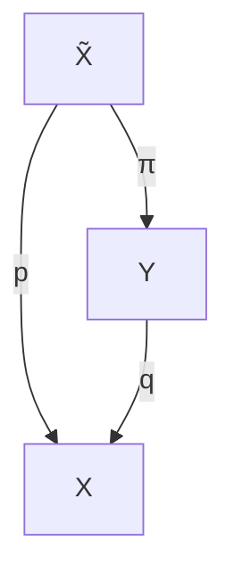
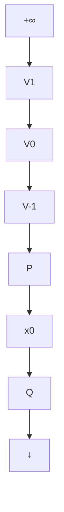

</details>

(a)


<details>
<summary>flowchart</summary>

```mermaid
graph TD
    A["\tilde{X}_1"] -->|f^{-1}| B["\tilde{X}_2"]
    A -->|p_1| C["X"]
    B -->|p_2| C
```
</details>

(b)   
图3.4.6 泛复叠空间

(2) 如果 $(\widetilde{X}, p)$ 是 $X$ 的泛复叠空间，而 $(Y, q)$ 是一个复叠空间，那么存在一个映射 $\pi: \widetilde{X} \to Y$ ，使得 $(\widetilde{X}, \pi)$ 是 $Y$ 的一个复叠空间。并且，图3.4.7可交换。


<details>
<summary>flowchart</summary>


</details>

图3.4.7 复叠空间

例3.4.4 如图3.4.8所示，设 $p: \mathbb{R} \to S^1$ 定义为 $p: t \mapsto (\cos(2\pi t), \sin(2\pi t))$ 。选任一点 $x_0 \in S^1$ ，如 $x_0 = (1, 0)$ 。考虑邻域 $U = \widehat{Px_0Q}$ ，它是右半圆。这是一个基本邻域，因为 $p^{-1}(U) = \left\{V_k = \left(k - \frac{1}{2}, k + \frac{1}{2}\right) \mid k \in Z\right\}$ 。现在其限制 $p: V_k \to U$ 是一个同胚。因此 $p$ 是一个投影。因此可得结论： $(\mathbb{R}, p)$ 是 $S^1$ 的一个复叠空间，重数是 $\chi_0$ 。（即可数）。

因为 $\pi (\mathbb{R}) = \{0\}$ 且 $\pi (S^1)\cong Z$ ，导出的同态 $p_*$ 是 $p_*\pi (\mathbb{R}) = \{0\} <  Z.$


<details>
<summary>flowchart</summary>


</details>

图3.4.8 $\mathbb{R}$ 是 $S^1$ 的复叠空间
