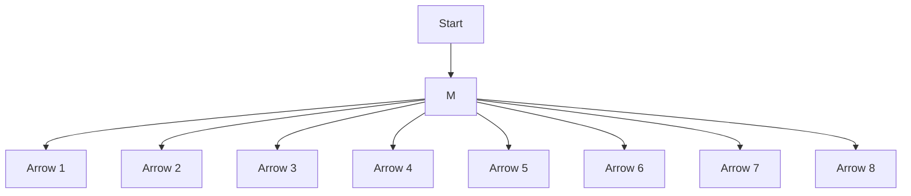

# 3.6 向量场

设 $M$ 为一 $n$ 维光滑流形， $x \in M$ (图3.6.1). 记 $C^r(M, x)$ 为 $x$ 点附近 $C^r$ 函数集合，即定义在 $x$ 某个邻域的函数的集合。设 $0 \in (a, b) \subset \mathbb{R}$ ，且 $\theta: (a, b) \to M$ 为一光滑映射使得 $\theta(t), t \in (a, b)$ 为 $M$ 上的一条曲线且 $\theta(0) = x$ .

flowchart

图3.6.1 切向量

对任一 $h \in C^r(M, x)$ , 定义映射 $\theta_*\left(\frac{\mathrm{d}}{\mathrm{d}t}\right): C^r(M, x) \to \mathbb{R}$ 为

$$\theta_ {*} \left(\frac {\mathrm{d}}{\mathrm{d} t}\right) h = \frac {\mathrm{d}}{\mathrm{d} t} (h \circ \theta) \Big | _ {t = 0}. \tag {3.6.1}$$

直观地说，这个映射将 $\mathbb{R}$ 上的一个导数算子变为 $M$ 上的一个导数算子。为了进一步分析，我们将它表示在一个坐标卡下。在一个关于 $x$ 的坐标卡中将 $\theta$ 用它

的分量表示为

$$\theta (t) = (\theta_ {1} (t), \dots , \theta_ {n} (t)) ^ {\mathrm{T}}.$$

同时 h 可表示为 $h = h(x_{1}, \cdots, x_{n})$ . 那么式 (3.6.1) 可通过链式法则表示为

$$\theta_ {*} \left(\frac {\mathrm{d}}{\mathrm{d} t}\right) h = \sum_ {i = 1} ^ {n} \frac {\mathrm{d} \theta_ {i}}{\mathrm{d} t} \Big | _ {t = 0} \frac {\partial h}{\partial x _ {i}}. \tag {3.6.2}$$

不难验证，在局部坐标下算子 $\theta_{*}\left(\frac{\mathrm{d}}{\mathrm{d}t}\right)$ 可表示为

$$\theta_ {*} \left(\frac {\mathrm{d}}{\mathrm{d} t}\right) = \sum_ {i = 1} ^ {n} \frac {\mathrm{d} \theta_ {i}}{\mathrm{d} t} \Big | _ {t = 0} \frac {\partial}{\partial x _ {i}}. \tag {3.6.3}$$

显见式 (3.6.2) 是 $\mathbb{R}$ 线性的，即

$$(a \theta_ {1} + b \theta_ {2}) _ {*} \left(\frac {\mathrm{d}}{\mathrm{d} t}\right) h = a (\theta_ {1}) _ {*} \left(\frac {\mathrm{d}}{\mathrm{d} t}\right) h + b (\theta_ {2}) _ {*} \left(\frac {\mathrm{d}}{\mathrm{d} t}\right) h.$$

因此, 在一个局部坐标系中所有经过 $x \in M$ 的曲线形成一个向量空间, 它以 $\left\{\frac{\partial}{\partial x_1}, \cdots, \frac{\partial}{\partial x_n}\right\}$ 为基底. 它可以看作作用在 $C^r(M, x)$ 上的方向导数空间.

定义3.6.1 对一个给定点 $x \in M$ ，作用在 $C^r(M, x)$ 上的方向导数空间，称为 $M$ 在 $x$ 处的切空间，记作 $T_x(M)$ .
