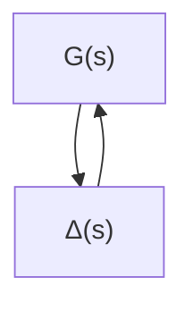
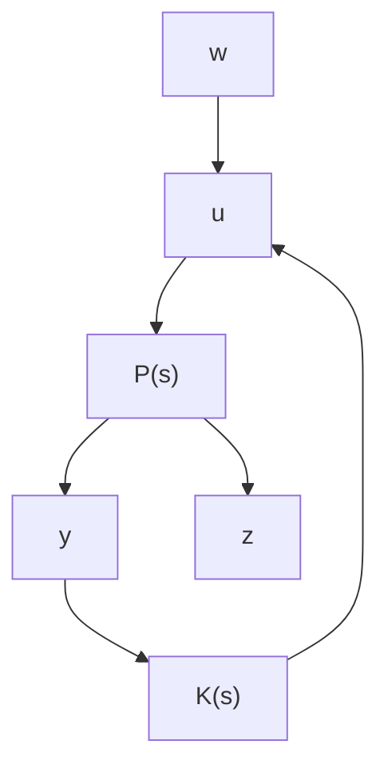

flowchart

图6.1.1 反馈系统

上述讨论表明，利用不确定性环节的幅频特性的上界以及引理6.1.2所示的 $H_{\infty}$ 范数的性质，我们可以解鲁棒镇定(Robust Stabilization)问题.

注6.1.3 在线性系统的频域设计理论中，许多设计指标可以用开环函数频域特性曲线的形状来描述。引理6.1.3则表明利用 $H_{\infty}$ 范数可以达到对幅频特性进行整形(Shapping)的目的，即如果我们希望系统的传递函数 $G(s)$ 的幅频特性曲线位于如图6.1.2所示的由曲线 $|M(\mathrm{j}\omega)|$ 所界定的区域以下，那么我们可以令 $W(s) = M^{-1}(s)$ ，并设定系统设计指标为

$$\| G (\cdot) W (\cdot) \| _ {\infty} < 1. \tag {6.1.12}$$

基于 $H_{\infty}$ 范数的混合灵敏度设计以及 LTR(Loop Transfer Recovery) [4] 等设计方法的依据就是引理 6-1.3 所示的性质

的界函数一题与频域整

问题，所谓

另外，如注6.1.2所述，条件(0-1)实际上等价不确定性环节 $P(s)=W(s)=M(s)$ 时的鲁棒锁定性条件。因此，虽然鲁棒锁定问题是具有不同工程背景的设计问题，但是从数学意义上讲是等价的 $\mu$ 。解析理论就是基于这种等价关系提出来的设计理论 $^{[6]}$ 。

text_image

|G(jω)|
M(jω)
ω

图 6.1.2 频域整形设计与 $H_{\infty}$ 函数约束条件

以 $H_{\infty}$ 范数作为设计指标的控制问题，一般可以表示为如图6.1.3所示的标准结构，其中 $u \in \mathbb{R}^p$ 和 $w \in \mathbb{R}^m$ 分别为控制输入信号和广义干扰输入信号（一般称为等价干扰输入）， $y \in \mathbb{R}^q$ 和 $z \in \mathbb{R}^r$ 则分别表示系统的可测量输出信号以及广义输出信号（也称为评价信号，用来描述欲抑制的输出响应），且 $P(s)$ 是由系统原始的受控对象以及各种加权函数构成的广义受控对象，记

$$
P (s) = \left[ \begin{array}{l l} P _ {1 1} (s) & P _ {1 2} (s) \\ P _ {2 1} (s) & P _ {2 2} (s) \end{array} \right]. \tag {6.1.13}
$$

flowchart

图 6.1.3 $H_{\infty}$ 标准设计问题

所谓 $H_{\infty}$ 标准设计问题可以叙述如下：对于给定的受控对象 $P(s)$ ，试求反馈控制器

$$u = K (s) y, \tag {6.1.14}$$

使得闭环系统是内部稳定的，同时从 $w$ 到 $z$ 的闭环传递函数阵 $G_{zw}(s)$ 满足

$$\| G _ {z w} (\cdot) \| _ {\infty} \leqslant 1, \tag {6.1.15}$$

其中

$$G _ {z w} (s) = P _ {1 1} (s) + P _ {1 2} (s) K (s) \big (I - P _ {2 2} (s) K (s) \big) ^ {- 1} P _ {2 1} (s).$$

下面通过两个例子来说明如何将实际控制问题归结为 $H_{\infty}$ 标准设计问题.

例 6.1.1 考虑如图 6.1.4 所示的反馈控制系统，其中 $G(s)$ 为受控对象的标称模型，未知有理函数 $\Delta G(s) \in RH_{\infty}$ 表示受控对象的未建模动态，即实际受控对象由

$$G _ {1} (s) = G (s) (1 + \Delta G (s)) \tag {6.1.16}$$
