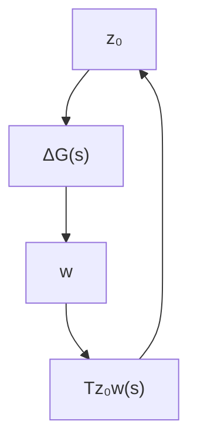

来描述. 设未建模动态 $\Delta G(s)$ 的频域特性曲线满足 $|\Delta G(j\omega)| \leqslant |R(j\omega)|, \forall \omega \in \mathbb{R}$ , 其中 $R(s)$ 是已知的界函数. 对于该系统, 我们考虑鲁棒镇定问题, 即设计反馈控制器 $K(s)$ 使得闭环系统对于任意 $\Delta G$ 是稳定的. 为此, 我们将该系统框图进行等价变换. 定义辅助信号 $w, z_0$ 如图6.1.4, 并记 $w$ 至 $z_0$ 的闭环传递函数为 $T_{z_0w}(s)$ , 那么该系统可以等价地表示如图6.1.5. 所以, 根据注6.1.2, 该闭环系统鲁棒稳定的一个充分条件是 $T_{z_0w}(s) \in RH_\infty$ 且满足

$$\| R ^ {- 1} (\cdot) T _ {z _ {0} w} (\cdot) \| _ {\infty} < 1. \tag {6.1.17}$$


<details>
<summary>flowchart</summary>

```mermaid
graph LR
    r[" r = 0 "] --> sum((+))
    sum --> e["e"]
    e --> K["K"]
    K --> u["u"]
    u --> delta["ΔG"]
    delta --> w["w"]
    w --> sum
    sum --> G["G"]
    G --> y["y"]
    y -->|-]
    y -->|feedback| sum
```
</details>

图 6.1.4 鲁棒镇定问题


<details>
<summary>flowchart</summary>


</details>

图6.1.5 等价系统

若定义广义输出信号为

$$z = R ^ {- 1} (s) z _ {0},$$

那么上述 $H_{\infty}$ 范数条件等价于图6.1.4中 $\Delta G(s)$ 通道被断开以后，从 $w$ 至 $z$ 的闭环传递函数 $T_{zw}(s) \in RH_{\infty}$ ，且 $\| T_{zw}(\cdot) \|_{\infty} < 1$ .

容易验证，若令广义受控对象如图 6.1.6 所示，即

$$
P (s) = \left[ \begin{array}{c c} 0 & - R ^ {- 1} (s) \\ G (s) & - G (s) \end{array} \right],
$$

并且 $K(s)$ 是该广义受控对象所对应的 $H_{\infty}$ 标准设计问题的解，则 $T_{zw}(s) = R^{-1}(s) \cdot T_{z_0w}(s)$ ，且式 (6.1.17) 成立。


<details>
<summary>flowchart</summary>

```mermaid
graph TD
    w --> z0
    z0 --> -R^-1_s["-R^-1(s)"]
    u --> G_s["G(s)"]
    G_s --> y
    y --> K_s["K(s)"]
    K_s --> z
    z0 --> z0
```
</details>

图6.1.6 $H_{\infty}$ 标准设计问题

例6.1.2 考虑如下式描述的受控对象：

$$
\left\{ \begin{array}{l} \dot {x} = A x + B _ {1} w + B _ {2} u, \\ y = C _ {2} x + D _ {2 1} w, \end{array} \right. \tag {6.1.18}
$$

其中 $x \in \mathbb{R}^n$ 为状态变量， $u \in R^r$ 和 $w \in R^q$ 分别为控制输入和干扰信号， $y \in \mathbb{R}^p$ 为可测量输出信号， $A, B_1, B_2, C_2, D_{21}$ 分别为相应阶数的定常矩阵。

为了减小干扰信号 $w$ 对系统调节性能的影响，与 $LQ$ 调节问题类似，我们引入性能指标

$$J = \int_ {0} ^ {\infty} \left(x ^ {\mathrm{T}} Q x + u ^ {\mathrm{T}} R u\right) \mathrm{d} t, \tag {6.1.19}$$

其中 $Q \geqslant 0$ 和 $R > 0$ 分别为加权矩阵。由于 $J$ 是 $\pmb{w}$ 的泛函，因此我们可以用两者之间的能量增益来作为衡量系统对干扰信号的抑制性能的指标，即

$$J \leqslant \varepsilon^ {2} \| w \| _ {2} ^ {2}, \quad \forall w \in L _ {q} ^ {2}, \tag {6.1.20}$$
