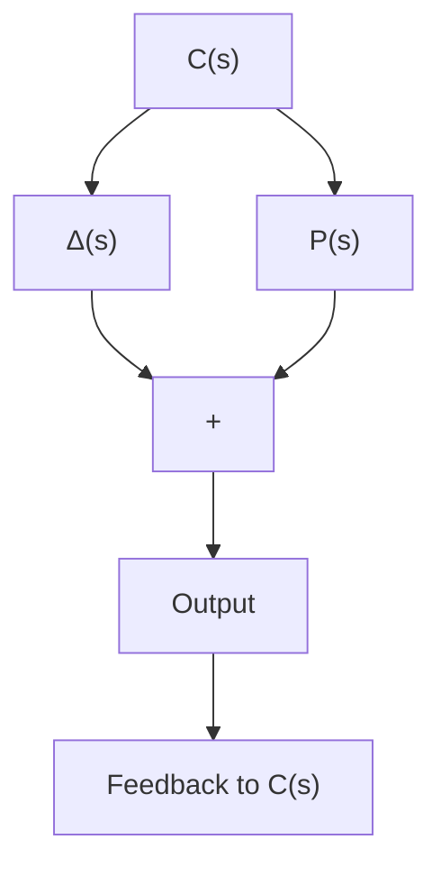

# 习题 6.1

6.1.1 令 $u(t) \in L_2[0, \infty)$ , $U(s)$ 表示 $u$ 的 Fourier 变换, 并且

$$\| u \| _ {2} = \left(\int_ {- \infty} ^ {+ \infty} u ^ {2} (\theta) \mathrm{d} \theta\right) ^ {\frac {1}{2}},\| U \| _ {2} = \left(\frac {1}{2 \pi} \int_ {- \infty} ^ {+ \infty} | U (\mathrm{j} \omega) | ^ {2} \mathrm{d} \omega\right) ^ {\frac {1}{2}}.$$

试证明如下恒等式（Parseval 恒等式）成立：

$$\| U \| _ {2} ^ {2} = \frac {1}{2 \pi} \| u \| _ {2} ^ {2}.$$

6.1.2 考虑如图 6.1.7 所示的标量系统. 设 $\Delta(s)$ 满足

$$| \Delta (\mathrm{j} \omega) | \leqslant | W (\mathrm{j} \omega) |. \quad \forall \omega \in \mathbb {R}$$

试证明该系统对于任意满足上式的 $\Delta(s)$ 是稳定的一个充分条件是如下不等式成立：

$$\| W (s) C (s) (1 - P (s) C (s)) ^ {- 1} \| _ {\infty} < 1.$$

flowchart

图 6.1.7 反馈系统
