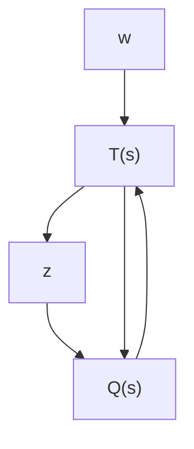

引理6.4.1 若 $T(s)$ 是内函数阵，且 $T_{21}^{-1}(s) \in RH_{\infty}^{p \times p}$ ，则该系统是内部稳定并且由 $w$ 至 $z$ 的闭环系统传递函数阵 $T_{zw}(s)$ 满足

$$\| T _ {z w} (\cdot) \| _ {\infty} < 1 \tag {6.4.8}$$

的充分必要条件是 $Q(s) \in RH_{\infty}^{q \times p}$ 且满足 $\| Q(\cdot)\|_{\infty} < 1$ .

flowchart

图 6.4.1 反馈控制系统

该引理是证明定理6.4.1的充分性的关键，其证明可参阅文献[5]的引理15.下面的引理给出了判定内函数阵的一个充分条件（证明参见文献[15]的引理2.6.1).

引理6.4.2 设 $T(s)$ 的状态空间实现为 $\{A, B, C, D\}$ , 满足 $D^{\mathrm{T}}D = I$ , 且 $(A, C)$ 是可检测的. 若存在半正定阵 $X \geqslant 0$ 满足

$$
\left\{ \begin{array}{l} X A + A ^ {\mathrm{T}} X = - C ^ {\mathrm{T}} C, \\ D ^ {\mathrm{T}} C + B ^ {\mathrm{T}} X = 0, \end{array} \right. \tag {6.4.9}
$$

则 A 为稳定阵且 $T(s)$ 是内函数阵.

下面简要介绍有关有理函数阵的代数性质的几个概念和结论.

如果一个方阵 $U(s)$ 使得 $U(s), U(s)^{-1} \in RH_{\infty}^{m \times m}$ , 则称 $U(s)$ 是有理函数阵环 $RH_{\infty}^{m \times m}$ 上的单位模阵. 有理函数阵 $R(s) \in RH_{\infty}^{m_1 \times m}$ 和 $S(s) \in RH_{\infty}^{m_2 \times m}$ 是右互质的, 当且仅当存在有理函数阵 $X(s) \in RH_{\infty}^{m \times m_1}$ 和 $Y(s) \in RH_{\infty}^{m \times m_2}$ 使得

$$X (s) R (s) + Y (s) S (s) = I.$$

因此，有理函数阵 $R(s) \in RH_{\infty}^{m_1 \times m}$ 和 $S(s) \in RH_{\infty}^{m_2 \times m}$ 互质意味着这两个函数矩阵除单位模阵以外不再含有右公因子阵。这就是说，如果存在一个适当的 $Z(s) \in RH_{\infty}^{m \times m}$ 满足 $R(s) = R_1(s)Z(s)$ ， $S(s) = S_1(s)Z(s)$ ，那么 $Z(s)$ 一定是单位模阵。

同理，两个行数相同的有理函数阵 $K(s) \in RH_{\infty}^{m \times m_1}$ 和 $H(s) \in RH_{\infty}^{m \times m_2}$ 是左互质的，当且仅当存在有理函数阵 $\hat{X}(s) \in RH_{\infty}^{m_1 \times m}$ 和 $\hat{Y}(s) \in RH_{\infty}^{m_1 \times m}$ 使得

$$K (s) \widehat {X} (s) + H (s) \widehat {Y} (s) = I.$$

实际上可以证明对于任意给定的 $n \times m$ 阶传递函数阵 $P(s)$ , 一定存在右互质阵 $N(s) \in RH_{\infty}^{n \times m}$ 和 $M(s) \in RH_{\infty}^{m \times m}$ , 以及左互质阵 $\widehat{N}(s) \in RH_{\infty}^{n \times m}$ 和 $\widehat{M}(s) \in RH_{\infty}^{n \times n}$ 使得

$$P (s) = N (s) M ^ {- 1} (s) = \widehat {M} ^ {- 1} (s) \widehat {N} (s). \tag {6.4.10}$$

上式称为传递函数阵 $P(s)$ 的 $RH_{\infty}$ 右(或左)既约分解.

如果 $P(s)$ 是如图6.4.2所示的反馈系统中受控对象的传递函数阵，那么根据其既约分解阵，可以给出反馈镇定控制器的通式。下述引理称为反馈镇定控制器的Youla参数表示(Youla parameterization, 证明参见文献[15]).

flowchart

