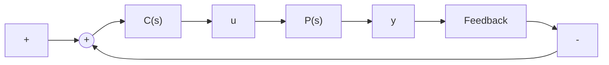

图 6.4.2 反馈镇定控制器

定理 6.4.2 设 $P(s)$ 的最小实现为 $\{A, B, C, D\}$ ，且 $(A, B)$ 是能稳的， $(C, A)$ 是可检测的。令

$$
N (s) = D + C _ {F} (s I - A _ {F}) ^ {- 1} B, \quad M (s) = I + F (s I - A _ {F}) ^ {- 1} B,
\begin{array}{l l} \widehat {X} (s) = I - F (s I - A _ {H}) ^ {- 1} B _ {H}, & \widehat {Y} (s) = - F (s I - A _ {H}) ^ {- 1} H, \\ \widehat {N} (s) = D + C (s I - A _ {H}) ^ {- 1} B _ {H}, & \widehat {M} (s) = I + C (s I - A _ {H}) ^ {- 1} H, \end{array} \tag {6.4.11}
X (s) = I - C _ {F} \left(s I - A _ {F}\right) ^ {- 1} H, \quad Y (s) = - F \left(s I - A _ {F}\right) ^ {- 1} H,
$$

其中 $F$ 和 $H$ 分别是使得 $A_{F} = A + BF, A_{H} = A + HC$ 为稳定阵的任意定常矩阵，而 $B_{H} = B + HD, C_{F} = C + DF.$ 那么

(1) $N(s), M(s), \widehat{N}(s), \widehat{M}(s)$ 是 $P(s)$ 的既约分解，即满足式 (6.4.10)，并且

$$\widehat {X} (s) M (s) - \widehat {Y} (s) N (s) = I, \tag {6.4.12}\widehat {M} (s) X (s) - \widehat {N} (s) Y (s) = I; \tag {6.4.13}$$

(2) 所有使闭环系统稳定的反馈控制器 $C(s)$ 都可以表示为

$$C (s) = - \{Y (s) + M (s) Q (s) \} \{X (s) + N (s) Q (s) \} ^ {- 1}, \tag {6.4.14}$$

其中 $Q(s) \in RH_{\infty}^{m \times m}$ 为自由参数阵.

最后我们介绍有关有理函数最佳逼近问题和有理函数阵的谱分解问题的基本结论.

定理6.4.3 设 $P(s)$ 的最小实现为 $\{A, B, C, D\}$ , 且 $-A$ 是稳定阵, 则

$$J _ {\min} = \inf _ {Q (s) \in R H _ {\infty} ^ {m \times p}} \sup _ {\omega \in \mathbf {R}} \bar {\sigma} \{P (\mathrm{j} \omega) - Q (\mathrm{j} \omega) \} = \sqrt {\lambda_ {\max} (L _ {C} L _ {O})}, \tag {6.4.15}$$

其中 $L_{C}$ 和 $L_{O}$ 分别是满足如下 Lyapunov 方程的半正定阵：

$$
\begin{array}{l} L _ {C} A ^ {\mathrm{T}} + A L _ {C} = B B ^ {\mathrm{T}}, \\ L _ {C} A + A ^ {\mathrm{T}} L _ {C} = C ^ {\mathrm{T}} C \end{array} \tag {6.4.16}
L _ {O} A + A ^ {\mathrm{T}} L _ {O} = C ^ {\mathrm{T}} C. \tag {6.4.16}
$$

注6.4.1 如果用 $\sup_{\omega \in \mathbb{R}} \bar{\sigma}\{P(\mathrm{j}\omega) - Q(\mathrm{j}\omega)\}$ 来表示有理函数 $P(s)$ 和 $Q(s)$ 的距离，那么上述定理实际上给出了 $P(s)$ 在 $RH_{\infty}$ 空间上的最佳逼近值。该定理也称为Nehari逼近定理。详细证明可参阅文献[7]，该文献中还给出了最佳逼近 $Q_{\min}(s)$ 的解析求法。

定理6.4.4 设 $m \times m$ 有理函数阵 $P(s)$ 的最小实现为 $\{A, B, C, 0\}$ , 且 $A$ 是稳定阵, 令

$$J (s) = I + P (s) + P ^ {\mathrm{T}} (- s), \tag {6.4.17}$$

则 $J(\mathbf{j}\omega) > 0, \forall \omega \in \mathbb{R}$ 的充分必要条件是 Riccati 方程

$$X (A - B C) + (A - B C) ^ {\mathrm{T}} X + X B B ^ {\mathrm{T}} X + C ^ {\mathrm{T}} C = 0 \tag {6.4.18}$$

有半正定解 $X$ 使得 $A_{X} = A - BC + BB^{\mathrm{T}}X$ 为稳定阵．同时， $J(s)$ 可以表示为

$$J (s) = S ^ {\mathrm{T}} (- s) S (s), \tag {6.4.19}$$
