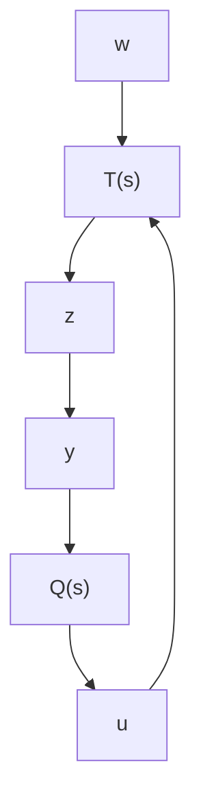

必要性. 设 $K(s)$ 是使得闭环系统内部稳定且 $\| T_{zw}(\cdot)\|_{\infty} < 1$ 成立的反馈控制器. 由于在该闭环系统中, 实际受控对象 (6.4.1) 是由 $u$ 到 $y$ 的通道, 其状态空间实现是 $P_{yu}(s) = C_2(sI - A)^{-1}B_2$ , 其中 $C_2 = [I0]^{\mathrm{T}}$ (稳定性只需考虑 $w = 0$ 的情况). 因此, 根据定理 6.4.2, 可知该控制器可以用适当的有理函数阵 $Q(s)$ 表示为

$$K (s) = - \{Y (s) + M (s) Q (s) \} \{X (s) + N (s) Q (s) \} ^ {- 1}, \tag {6.4.25}$$

其中 $N(s)$ 和 $M(s)$ 是 $P_{yu}(s)$ 的右既约分解阵. 如定理6.4.2所示, 取 $F$ 使得 $A_F = A + B_2F$ 是稳定阵, 并且令 $H = [B_2F - B_1]$ , 使得 $A_H = A + HC_2 = A + B_2F = A_F$ , 得到

$$
\begin{array}{l} N (s) = C _ {2} \left(s I - A _ {F}\right) ^ {- 1} B _ {2}, \\ M (s) = I + F \left(s I - A _ {F}\right) ^ {- 1} B _ {2}, \\ X (s) = I - C _ {2} \left(s I - A _ {F}\right) ^ {- 1} H, \\ Y (s) = - F (s I - A _ {F}) ^ {- 1} H. \\ \end{array}
$$

实际上，可以用Riccati方程

$$P A + A ^ {\mathrm{T}} P - P B _ {2} B _ {2} ^ {\mathrm{T}} P + C _ {1} ^ {\mathrm{T}} C _ {1} = 0 \tag {6.4.27}$$

的半正定解 $P$ 来构造理想的 $F = -B_2^{\mathrm{T}}P$ , 因为根据假设 (A1), 上述 Riccati 方程有使得 $A_F = A + B_2F = A - B_2B_2^{\mathrm{T}}P$ 成为稳定阵的半正定解 $P$ .

利用两端口网络的线性分式变换 (Linear Franctional Transformation), 该控制器可以表示如图 6.4.3 所示, 其中传递函数阵 $\Sigma(s)$ 的状态空间实现为 (详细证明可参阅文献 [15] 的第 3 章)

$$
\left\{A _ {F} + H C _ {2}, [ H B _ {2} ], - \left[ \begin{array}{l} F \\ C _ {2} \end{array} \right], - \left[ \begin{array}{l l} 0 & I \\ I & 0 \end{array} \right] \right\}. \tag {6.4.28}
$$


<details>
<summary>flowchart</summary>

```mermaid
graph TD
    y --> Σ[Σ(s)]
    Σ --> u
    u --> Q["Q(s)"]
    Q --> Σ
    Σ --> Q
```
</details>

图 6.4.3 控制器的线性变换表示

因此，由受控对象 (6.4.1) 和该控制器构成的闭环系统如图 6.4.4 所示，相应的传递函数阵

$$
T (s) = \left[ \begin{array}{c c} T _ {1 1} (s) & T _ {1 2} (s) \\ T _ {2 1} (s) & T _ {2 2} (s) \end{array} \right]
$$

的状态空间实现为

$$
\left\{\left[ \begin{array}{l l} A _ {F} & B _ {2} F \\ 0 & A _ {F} \end{array} \right], \left[ \begin{array}{l l} B _ {1} & B _ {2} \\ 0 & 0 \end{array} \right], \left[ \begin{array}{l l} C _ {F ^ {\prime}} & D _ {1 2} F \\ 0 & C _ {2} \end{array} \right], - \left[ \begin{array}{l l} 0 & D _ {1 2} \\ D _ {2 1} & 0 \end{array} \right] \right\}, \tag {6.4.29}
$$


<details>
<summary>flowchart</summary>


</details>

图 6.4.4 闭环系统的等价表示

其中 $C_F = C_1 + D_{12}F, D_{21} = [0 I]^{\mathrm{T}}$ .

容易验证
