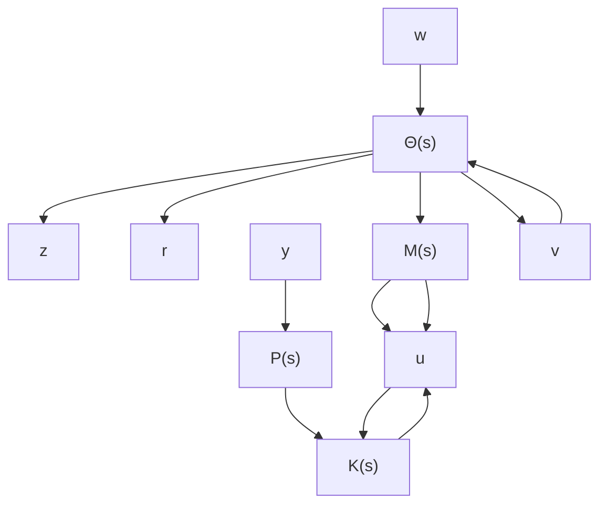

这时 $H_{\infty}$ 输出反馈设计问题的一个解给定如下：

$$
\left\{ \begin{array}{l} A _ {c} = A + B _ {1} B _ {1} ^ {\mathrm{T}} X - Z ^ {- 1} L C _ {2} + B _ {2} F, \\ B _ {c} = - Z ^ {- 1} L, \\ C _ {c} = F, \\ D _ {c} = 0, \end{array} \right. \tag {6.6.9}
$$

其中 $F = -B_{2}^{\mathrm{T}}X, L = YC_{2}^{\mathrm{T}}, Z = I - XY.$

证明 充分性. 令有理函数阵 $\Theta(s)$ 和 $M(s)$ 的状态空间实现分别定义如下:

$$
\Theta (s): \left\{A + B _ {2} F, [ B _ {1} B _ {2} ], \left[ \begin{array}{c} C _ {F} \\ - B _ {1} ^ {\mathrm{T}} X \end{array} \right], \left[ \begin{array}{c c} 0 & D _ {1 2} \\ I & 0 \end{array} \right] \right\}, \tag {6.6.10}

M (s): \left\{A + B _ {1} B _ {1} ^ {\mathrm{T}} X, [ B _ {1} B _ {2} ], - F, \left[ \begin{array}{c c} 0 & I \\ D _ {2 1} & 0 \end{array} \right] \right\}, \tag {6.6.11}
$$

其中 $C_F = C_1 + D_{12}F$ 。那么由方程 (6.6.1) 描述的广义受控对象

$$
\left[ \begin{array}{c} z \\ y \end{array} \right] = P (s) \left[ \begin{array}{c} w \\ u \end{array} \right]
$$

可以表示为如图6.6.1所示的两个二端口网络的串接形式，即

$$
\left[ \begin{array}{c} z \\ r \end{array} \right] = \Theta (s) \left[ \begin{array}{c} w \\ v \end{array} \right],

\left[ \begin{array}{c} v \\ y \end{array} \right] = M (s) \left[ \begin{array}{c} r \\ u \end{array} \right].
$$

flowchart

图 6.6.1 受控对象的等价表示

首先我们证明 $\Theta(s)$ 是内函数阵. 令 $E = [0 - XB_1]$ , 则

$$
A + B _ {2} F + E \left[ \begin{array}{c} C _ {F} \\ - B _ {1} ^ {\mathrm{T}} X \end{array} \right] = A + (B _ {1} B _ {1} ^ {\mathrm{T}} - B _ {2} B _ {2} ^ {\mathrm{T}}) X
$$

是稳定阵. 于是 $\Theta(s)$ 的实现是能检测的. 同时由假设条件 (A3), Riccati 方程 (6.6.6) 可以表示为

$$
(A + B _ {2} F) ^ {\mathrm{T}} X + X (A + B _ {2} F) = - [ C _ {F} ^ {\mathrm{T}} - X B _ {1} ] \left[ \begin{array}{c} C _ {F} \\ - B _ {1} ^ {\mathrm{T}} X \end{array} \right],
$$

且有

$$
\left[ \begin{array}{c c} 0 & D _ {1 2} \\ I & 0 \end{array} \right] ^ {\mathrm{T}} \left[ \begin{array}{c} C _ {F} \\ - B _ {1} ^ {\mathrm{T}} X \end{array} \right] + [ B _ {1} B _ {2} ] ^ {\mathrm{T}} X = 0. \tag {6.6.12}
$$

所以从引理6.4.2可知 $\Theta (s)$ 是内函数阵.

其次将 $\Theta(s)$ 按照输入信号分块

$$
\Theta (s) = \left[ \begin{array}{l l} \Theta_ {1 1} (s) & \Theta_ {1 2} (s) \\ \Theta_ {2 1} (s) & \Theta_ {2 2} (s) \end{array} \right], \tag {6.6.13}
$$
