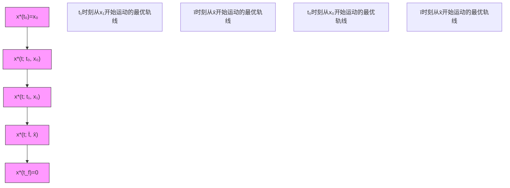

另一方面，任取 $v(\cdot) \in \mathcal{U}_{[t_0, t_f]}$ ，记式 (7.1.52)，(7.1.53) 的相应于 $v(t)$ 的解为 $x(t)$ . 由不等式 (7.1.76) 知

$$\frac {\partial J ^ {*} (x (t) , t)}{\partial t} + \frac {\partial J ^ {*} (x (t) , t)}{\partial x} f (x (t), v (t)) + l (x (t), v (t)) \geqslant 0.$$

从 $t_0$ 到 $t_f$ 积分上式，考虑到 $x(t_0) = 0, x(t_f) = 0$ 可得

$$J ^ {*} (x _ {0}, t _ {0}) \leqslant \int_ {t _ {0}} ^ {t _ {f}} l (x (t), v (t)) \mathrm{d} t. \tag {7.1.82}$$

比较 (7.1.81) 和 (7.1.82) 即知， $\forall v(t) \in \mathcal{U}_{[t_0, t_f]}$ ，有

$$J ^ {*} (x _ {0}, t _ {0}) = \int_ {t _ {0}} ^ {t _ {f} ^ {*}} l (x ^ {*} (t), u ^ {*} (t)) \mathrm{d} t \leqslant \int_ {t _ {0}} ^ {t _ {f}} l (x (t), v (t)) \mathrm{d} t.$$

综上所述得:

定理 7.1.5 假设带边值条件的 Bellman 方程 (7.1.73) 在 $R^{n} \times [t_{0}, t_{f}^{*}]$ 上存在古典 $C^{1}$ 非零解 $(J^{*}(x, t), u^{*}(x, t))$ ，则 $u^{*}(x, t)$ 是最优控制问题 (7.1.52)，(7.1.53) 和 (7.1.54) 综合函数， $J^{*}(x, t)$ 是相应的最优性能指标值.

注7.1.6 当性能指标(7.1.54)中， $\forall u\neq 0,$ 有 $l(x,u,t) > 0$ 时，可以证明相应的Bellman方程存在古典 $C^1$ “非零解”.

注7.1.7 对于终端状态 $x(t_{f})$ 自由和性能指标中包含非积分项的情况，同样能够得到类似于定理7.1.5和注7.1.6中的结论.

从 Bellman 方程得到的 $u^{*}(x,t)$ 是最优控制综合函数，即是具有状态反馈形式的最优控制函数，其图示理解为：在最优控制综合函数的作用下，系统从任意初态开始，它都以最优方式运行至终端状态 $x(t_{f})$ ，例如，当 $x(t_{f}) = 0$ 时的图示如下：

flowchart

图7.1.4

一般情况下，带边值条件的 Bellman 方程仅存在古典意义下的局部解。后面将看到，有一类很重要的最优控制问题，其相应的 Bellman 方程存在古典意义下的全局解。有关 Bellman 方程“广义解”的工作可参见文献 [8].
