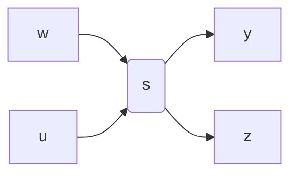

# 线性定常多变量系统的频域描述

考虑受外部干扰影响的线性定常受控对象，其输入输出关系的框图如图 7.5.1 所示.

flowchart

图7.5.1

图7.5.1中控制输入 $u \in \mathbb{C}^{p_1}$ , 外干扰输入 $w \in \mathbb{C}^{p_2}$ , 量测输出 $y \in \mathbb{C}^{m_1}$ , 被调输出 $z \in \mathbb{C}^{m_2}$ , 这里 $\mathbb{C}^l$ 表示 $l$ 维复欧氏空间, $p_1, p_2, m_1$ 和 $m_2$ 皆为正整数. $G(s)$ 为被控对象的传递函数矩阵, 是一个 $(m_1 + m_2) \times (p_1 + p_2)$ 有理分式矩阵, 即它的元皆是复变量的有理分式, $s \in \mathbb{C}$ . $[z, y]^{\mathrm{T}}$ 和 $[w, u]^{\mathrm{T}}$ 之间的传递关系为

$$
\left[ \begin{array}{l} z \\ y \end{array} \right] = G (s) \left[ \begin{array}{l} w \\ u \end{array} \right]. \tag {7.5.1}
$$

关系式 (7.5.1) 是受外部干扰影响的线性定常受控对象的频域描述形式，简称为带干扰的线性定常系统。

注7.5.1 前面几节中涉及的线性定常系统是未受外干扰线性受控对象一种特殊状态空间描述，那里被调变量和量测变量是相同的，且量测变量和控制变量之间无代数约束关系。利用Laplace变换和线性控制理论中实现理论，线性定常系统的两种描述形式之间能相互转换。

系统增益和信号范数 考察图 7.5.2 所示的频域描述的线性对象， $v(s)$ ， $z(s)$ 分别是对象的输入，输出信号，是复变量 s 的适当维数的复向量值函数， $F(s)$ 为对象（装置）的传递函数矩阵，是实真有理分式矩阵.

flowchart

图7.5.2

图7.5.2中线性对象的数学表示为

$$z (s) = F (s) v (s). \tag {7.5.2}$$

输入，输出信号之间的传递关系可解释为其能量之间的传递。系统增益可理解为能量传递的增加或减少系数。为此，我们用矩阵范数描述系统增益。信号能量用 $H_{2}$ 空间（见文献[7]）中的范数度量。于是从式(7.5.2)推出

$$\| z \| _ {2} = \| F v \| _ {2} \leqslant \| F \| _ {2} \cdot \| v \| _ {2},$$

其中 $\| \cdot \|_2$ 表示 $H_{2}$ 空间中的范数，而 $\| F\| _2$ 表示传递函数矩阵 $F(s)$ 的相应的矩阵范数

$$\| F \| _ {2} \stackrel {\text { def }} {=} \sup \{\| F v \| _ {2} \mid \| v \| _ {2} = 1, v \in H _ {2} \}. \tag {7.5.3}$$

可以证明 (见文献 [7]p. 31 定理 31)

$$\| F \| _ {2} ^ {2} = \sup \{\| F (j \omega) \| ^ {2} \mid \omega \in \mathbb {R} \} = \sup \{\bar {\sigma} (F (j \omega)) \mid \omega \in \mathbb {R} \} = \| F \| _ {\infty} ^ {2}, \tag {7.5.4}$$

这里 $\| F\|_{\infty}$ 表示 $H_{\infty}$ 空间中的范数（见文献[7]），其中 $\bar{\sigma} (F(\mathrm{j}\omega))$ 表示 $F(\mathrm{j}\omega)$ 的奇异值，即 $F^{\mathrm{H}}(\mathrm{j}\omega)F(\mathrm{j}\omega)$ 的最大本征值 $\sigma_{\max}(F^{\mathrm{H}}(\mathrm{j}\omega)F(\mathrm{j}\omega))$ ，关系式(7.5.4）把传递函数矩阵的 $H_{2}$ 范数和 $H_{\infty}$ 范数联系起来了.
