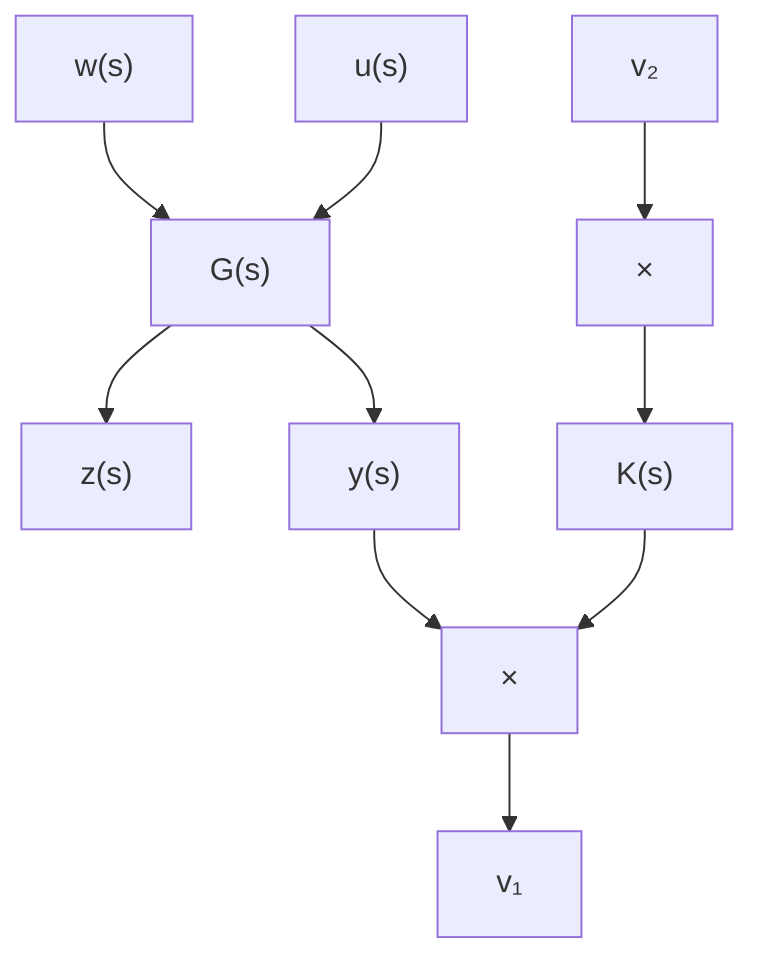
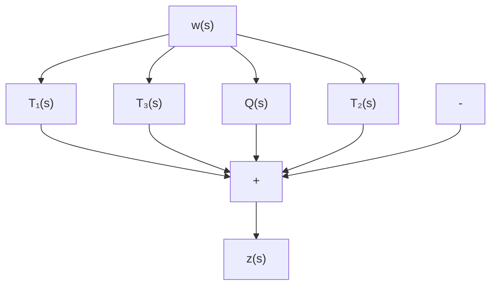

# 频域中的 $H_{\infty}$ 控制

考虑受外干扰影响的系统 (7.5.1), 其 $H_{\infty}$ 控制问题是指: 是要求设计控制器 $u(s) = K(s)y(s)$ , 使得在此控制器作用下的闭环系统内部稳定, 且外干扰 $w(s)$ 对被调输出 $z(s)$ 的影响“尽可能小”. 这里闭环系统内部稳定是指当无外干扰 $w(s) = 0$ 时, 闭环系统是渐近稳定的, 即控制器 $u(s) = K(s)y(s)$ 能镇定对象 $G(s)$ . $w(s)$ 对 $z(s)$ 的影响“尽可能小”, 是指该控制器对干扰具有一定的抑制能力. $H_{\infty}$ 控制问题可以认为是干扰抑制问题. 闭环框图示于图 7.5.3, 其中 $v_{1}, v_{2}$ 为参考输入.

flowchart

图7.5.3

令 $G(s) = \begin{bmatrix} G_{11}(s) & G_{12}(s) \\ G_{21}(s) & G_{22}(s) \end{bmatrix}$ , 其中诸 $G_{ij}(s)$ 为具有适当行和列数的矩阵. 利用 (7.5.1) 和框图 7.5.3 ( $v_1 = v_2 = 0$ 时) 可得到

$$
\left\{ \begin{array}{l} z (s) = G _ {1 1} (s) w (s) + G _ {1 2} (s) u (s), \\ y (s) = G _ {2 1} (s) w (s) + G _ {2 2} (s) u (s), \\ u (s) = K (s) y (s). \end{array} \right. \tag {7.5.5}
$$

从 (7.5.5) 得到 $w(s)$ 和 $z(s)$ 之间的传递关系为

$$z (s) = F _ {l} (s) w (s), \tag {7.5.6}$$

其中 $F_{l}(s) = G_{11}(s) + G_{12}(s)K(s)(I_{m_2} - G_{22}(s)K(s))^{-1}G_{21}(s).$

系统 (7.5.1) 的标准 $H_{\infty}$ 控制问题是指求一个实有理分式矩阵 $K(s)$ , 称之为控制矩阵, 使得

(1) 相应的闭环系统是内部稳定的，即当 $w(s) = 0$ 时， $u(s) = K(s)y(s)$ 镇定 (7.5.1);

(2) $F_{l}(s)$ 的 $H_{\infty}$ 范数达到极小.

注7.5.2 (1)中相应于(7.5.1)的闭环系统内部稳定是指：当 $t\to +\infty$ 时，闭环系统的状态（包括原开系统的状态和补偿器的状态）趋于零；

(2) 等价于寻求满足 (1) 并使 $\| F_l\|_{\infty}$ 达到极小的 $K(s)$ , 即要求

$$\inf _ {K (\cdot)} \sup _ {\omega} \sigma_ {\max} (F _ {l} ^ {\mathrm{H}} (\mathrm{j} \omega) F _ {l} (\mathrm{j} \omega)). \tag {7.5.7}$$

(7.5.7) 表达的是一个“条件极小极大”问题，通常简称为“最优问题”.

求解 $H_{\infty}$ 控制问题时，可将上述标准 $H_{\infty}$ 控制问题化为如下模型匹配问题求解之：

考察由下框图7.5.4所示的模型匹配系统(见文献[7]p.34)，其中 $T_{i}(s)\in \mathcal{R}H_{\infty}$ $i = 1,2,3,Q(s)\in \mathcal{R}H_{\infty}$ 待求． $\mathcal{RH}_{\infty}$ 表示严格真且稳定的实有理分式矩阵的集合.

flowchart

图7.5.4

对于如图7.5.4所示模型匹配系统，其 $H_{\infty}$ 控制的设计问题是指求 $Q(s)$ 使 $\| T_1 - T_2QT_3\|_{\infty}$ 达到极小.
