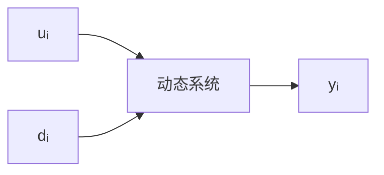
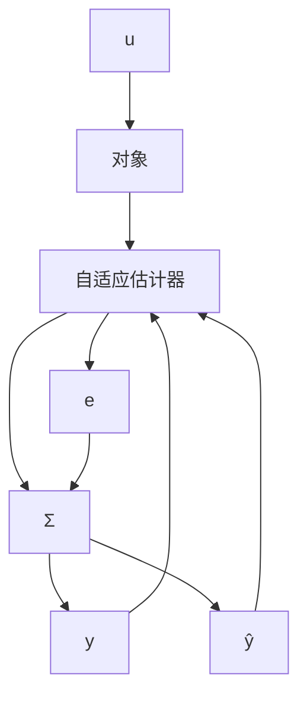
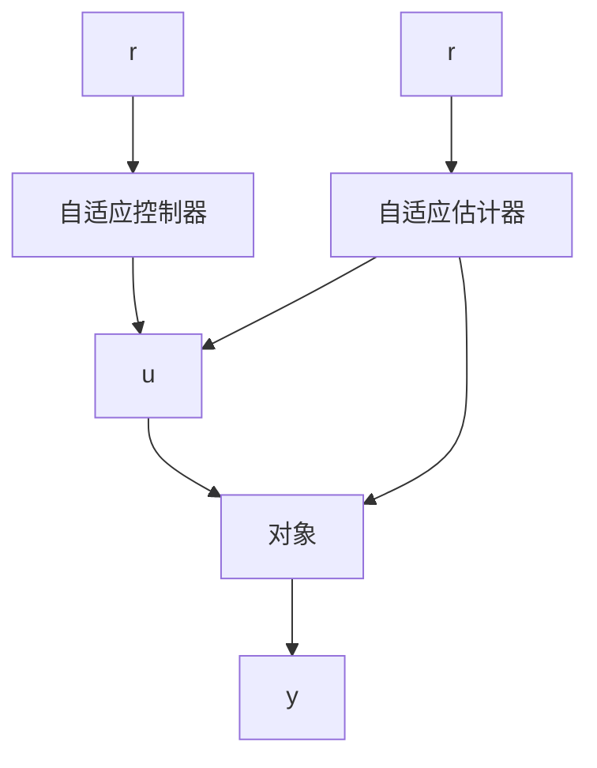

# 9.1 什么是自适应系统

在日常生活中，自适应是指一生物体（或系统）调整自己的行为以适应外部（或内部）环境（或情况）的新的改变。因此，自适应有两个关键的相关问题：根据新的信息（改变的情况）知道了些什么？如何作出相应的反应（调节）？用更加专业的术语来讲，第一个问题属于估计、或辨识、或学习……，而第二个问题则属于控制、或决策、或调整……无论是估计或控制都需要信息，而信息的有效利用可以消除（或减少）系统中不确定性所带来的影响。

从实际中看，对任何复杂动态系统建模时，其数学模型都不可能完全精确地描述实际系统的结构或行为，也就是说，模型中应该考虑不确定性因素的影响。粗略来讲，系统中的不确定性可分为两类：内部不确定性和外部不确定性。内部不确定性是指描述系统的结构和参数的不确定性，而外部不确定性是指外部环境对系统的影响。需要指出的是，“内部”和“外部”之分在很大程度上是“人为”的，往往依具体系统和易处理的程度而定。进一步，系统“内部”的结构和参数往往也受外部环境变化的影响，因而“内部”和“外部”也是相对的。

系统“外部”未知(或不可知)的环境往往被当作扰动来处理，而“内部”模型的不确定性可分为如下三类：

A. 参数不确定性。例如，系统模型中含有某一未知的参数向量 $\theta$ ;

B. 信号不确定性。例如，系统模型中含有一个未知的且随时间变化的信号过程 $\{\theta(t)\}$ ;

C. 函数不确定性. 例如, 系统模型中含有某一个未知的函数关系 $f(\cdot)$ 等.

那么如何消除 (或减少) 系统中不确定性对系统性能的影响？这就需要利用后验信息。先验信息是系统运行前对系统的了解，而后验信息是指系统运行过程中通过系统输入和输出信号而“反映”出的系统内部的结构及其信息变化。

考虑如下的具有输入序列 $\{u_t\}$ 、输出序列 $\{y_t\}$ 和扰动序列 $\{d_t\}$ 的动态系统，如图9.1.1所示：

flowchart

图9.1.1

在任一时刻 $t > 0$ ，系统的后验信息是指

$$\{y _ {i}, u _ {i}: i \leqslant t \}.$$

显然，只有通过自适应方法（自适应估计或控制）来利用后验信息，才有可能减少系统中存在的不确定性及其影响.

什么是自适应估计？直观上来讲，自适应估计是一个关于系统的参数（或结构）的估计器，这个估计器可以随着在线观测到的系统数据的增多而不断地修正或更新，例见图9.1.2：

flowchart

图9.1.2

其中 $e$ 表示实际输出和模型输出之差 (在同一个输入信号 $u$ 下), 一般称为预报误差. 自适应估计器一般是根据预报误差 $e$ 的值来不断进行调节的. 在参数模型情形下, 对未知参数 $\theta$ 的估计 $\theta_{t}$ 一般是根据优化关于预报误差 $e$ 的某个泛函来获取的 (详见9.2节及9.4节).

什么是自适应控制？迄今并没有严格的数学定义，但这并不妨碍对这一问题的研究。从实用的角度讲，自适应控制可看作是这样一个控制器：它具有可调节的参数或结构以及相应的调节机制。图9.1.3是一个典型的自适应控制框图，我们看到，在反馈回路中，同时具有自适应估计器和自适应控制器，后者是基于前者而构造的。

flowchart

图9.1.3

不难看出，无论是自适应估计还是自适应控制，它们都是利用不确定性动态系统的在线观测信号而构造的非线性映射。正因为如此，一般来讲，从数学上进行这类非线性分析并不容易，但这一特点也正决定了自适应方法有能力对付较大的系统不确定性。
