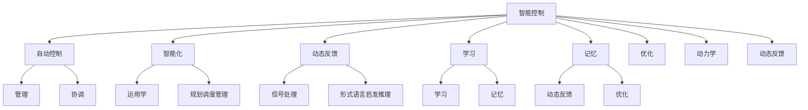

# 2. 智能控制的概念

智能控制是一门交叉学科，著名美籍华人傅京逊教授1971年首先提出智能控制是人工智能与自动控制的交叉，即二元论。美国学者G.N.Saridis于1977年在此基础上引入运筹学，提出了三元论的智能控制概念，即

$$\mathrm{IC} = \mathrm{AC} \cap \mathrm{AI} \cap \mathrm{OR}$$

式中各子集的含义为: IC 为智能控制(Intelligent Control); AI 为人工智能(Artificial Intelligence); AC 为自动控制(Automatic Control); OR 为运筹学(Operational Research)。基于三元论的智能控制如图 1-1 所示。

人工智能(AI)是一个用来模拟人的思维的知识处理系统,具有记忆、学习、信息处理、形式语言、启发推理等功能。

flowchart

图 1-1 基于三元论的智能控制

自动控制(AC)描述系统的动力学特性,是一种动态反馈。

运筹学(OR)是一种定量优化方法,如线性规划、网络规划、调度、管理、优化决策和多目标优化方法等。

三元论除了“智能”与“控制”外，还强调了更高层次控制中调度、规划和管理的作用，为递阶智能控制提供了理论依据。

所谓智能控制,即设计一个控制器(或系统),使之具有学习、抽象、推理、决策等功能,并能根据环境(包括被控对象或被控过程)信息的变化做出适应性反应,从而实现由人来完成的任务。
