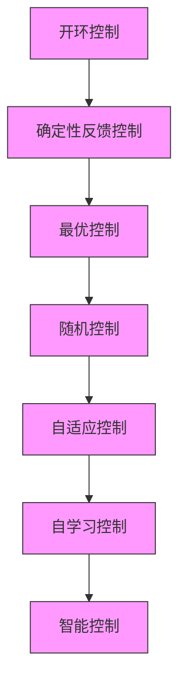

# 3. 智能控制的发展

智能控制是自动控制发展的最新阶段,主要用于解决传统控制难以解决的复杂系统的控制问题。控制科学的发展过程如图 1-2 所示。

flowchart

图1-2 控制科学的发展过程

从 20 世纪 60 年代起,由于空间技术、计算机技术及人工智能技术的发展,控制界学者在研究自组织、自学习控制的基础上,为了提高控制系统的自学习能力,开始注意将人工智能技术与方法应用于控制中。

1966 年, J. M. Mendal 首先提出将人工智能技术应用于飞船控制系统的设计; 1971 年, 傅京逊首次提出智能控制这一概念, 并归纳了 3 种类型的智能控制系统。

① 人作为控制器的控制系统: 人作为控制器的控制系统具有自学习、自适应和自组织的功能。

② 人机结合作为控制器的控制系统: 机器完成需要连续进行的并需快速计算的常规控制任务, 人则完成任务分配、决策、监控等任务。

③ 无人参与的自主控制系统:为多层的智能控制系统,需要完成问题求解和规划、环境建模、传感器信息分析和低层的反馈控制任务,如自主机器人。

1985 年 8 月, IEEE 在美国纽约召开了第一届智能控制学术讨论会, 随后成立了 IEEE 智能控制专业委员会; 1987 年 1 月, 在美国举行第一次国际智能控制大会, 标志着智能控制领域的形成。

近年来,神经网络、模糊数学、专家系统、进化论等各门学科的发展给智能控制注入了巨大的活力,由此产生了各种智能控制方法。智能控制的几个重要分支为专家控制、模糊控制、神经网络控制和遗传算法。
