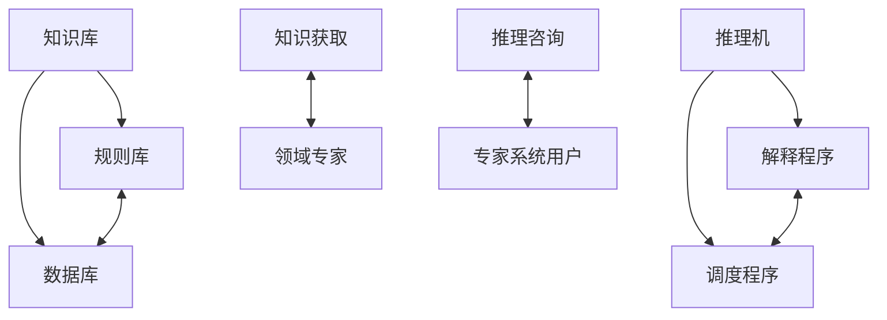

# 2.1.2 专家系统的构成

专家系统主要由知识库和推理机构成,专家系统的结构如图 2-1 所示。

flowchart

```mermaid
graph TD
    A["知识库"] --> B["规则库"]
    A --> C["数据库"]
    D["推理机"] --> E["解释程序"]
    D --> F["调度程序"]
    G["知识获取"] <--> H["领域专家"]
    I["推理咨询"] <--> J["专家系统用户"]
    B <--> C
    E <--> F
```

图2-1 专家系统的结构
