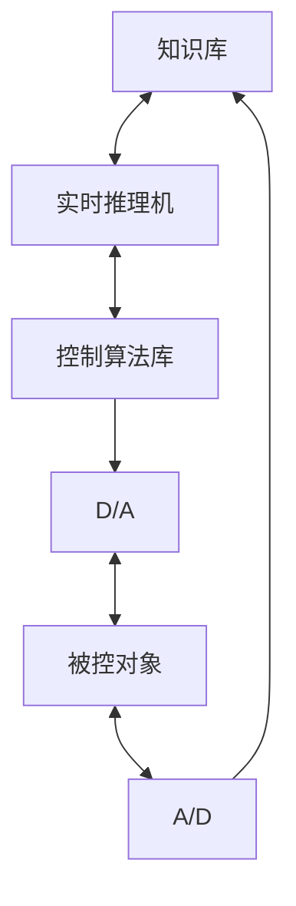

# 1. 结构

专家控制的基本结构如图 2-2 所示。

flowchart

```mermaid
graph TD
    A["知识库"] <--> B["实时推理机"]
    B <--> C["控制算法库"]
    C --> D["D/A"]
    D <--> E["被控对象"]
    E <--> F["A/D"]
    F --> A
```

图 2-2 专家控制的基本结构
