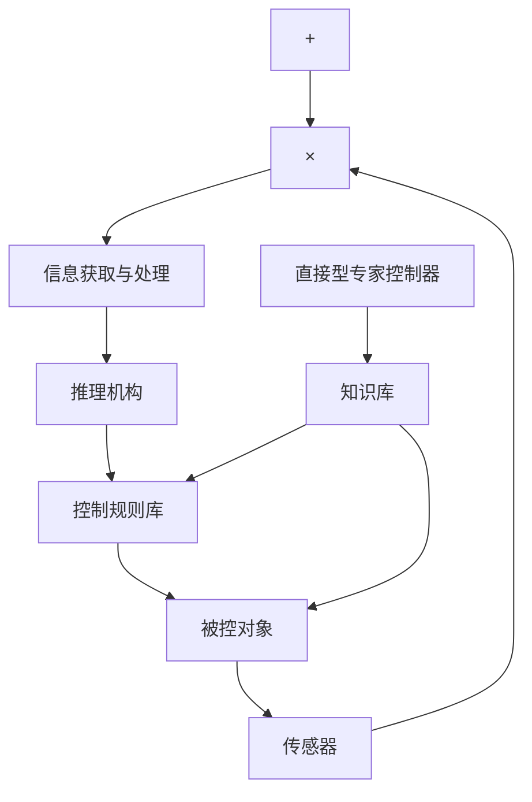

# (1) 直接型专家控制器

直接型专家控制器用于取代常规控制器，直接控制生产过程或被控对象。具有模拟（或延伸、扩展）操作工人智能的功能。该控制器的任务和功能相对比较简单，但需要在线、实时控制。因此，其知识表达和知识库也较简单，通常由几十条产生式规则构成，以便于增删和修改。

直接型专家控制器的结构如图 2-3 中的虚线所示。

flowchart

```mermaid
graph TD
    A["+"] --> B["×"]
    B --> C["信息获取与处理"]
    C --> D["推理机构"]
    D --> E["控制规则库"]
    E --> F["被控对象"]
    F --> G["传感器"]
    G --> B
    H["直接型专家控制器"] --> I["知识库"]
    I --> E
    I --> F
```

图 2-3 直接型专家控制器的结构
