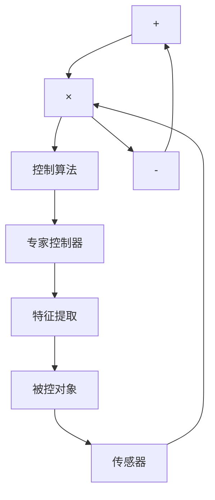

# (2) 间接型专家控制器

间接型专家控制器用于和常规控制器相结合，组成对生产过程或被控对象进行间接控制的智能控制系统。具有模拟(或延伸、扩展)控制工程师智能的功能。该控制器能够实现优化适应、协调、组织等高层决策的智能控制。按照高层决策功能的性质，间接型专家控制器可分为以下几种类型。

① 优化型专家控制器: 是基于最优控制专家知识和经验的总结和运用。通过设置整定值、优化控制参数或控制器, 实现控制器的静态或动态优化。  
② 适应型专家控制器: 是基于自适应控制专家的知识和经验的总结和运用。根据现场运行状态和测试数据, 相应地调整控制律, 校正控制参数, 修改整定值或控制器, 适应生产过程、对象特性或环境条件的漂移和变化。  
③ 协调型专家控制器: 是基于协调控制专家和调度工程师的知识和经验的总结和运用。用以协调局部控制器或各子控制系统的运行, 实现大系统的全局稳定和优化。  
④ 组织型专家控制器: 是基于控制工程组织管理专家或总设计师的知识和经验的总结和运用。用以组织各种常规控制器, 根据控制任务的目标和要求, 构成所需要的控制系统。

间接型专家控制器可以在线或离线运行。通常，优化型、适应型需要在线、实时、联机运行；协调型、组织型可以离线、非实时运行，作为相应的计算机辅助系统。

间接型专家控制器的结构如图 2-4 所示。

flowchart

图 2-4 间接型专家控制器的结构
