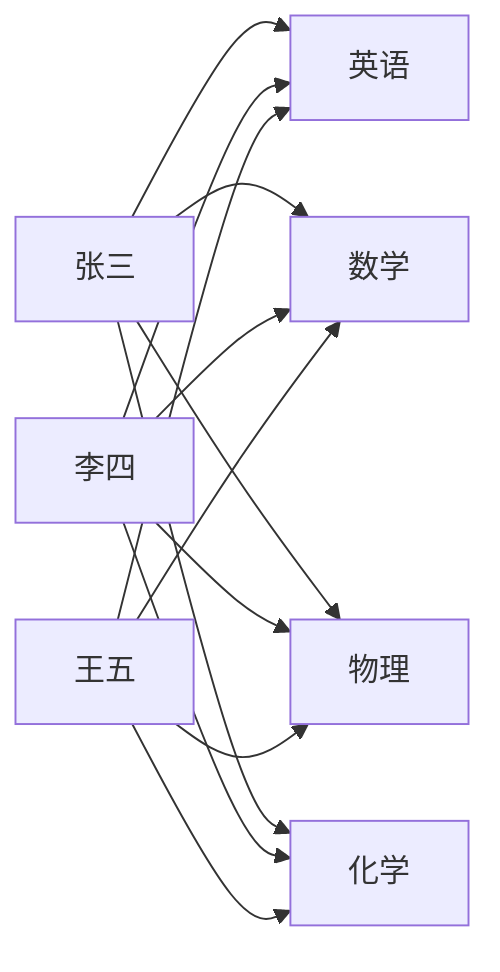

# 3.4.1 模糊矩阵

【例 3.6】设有一组同学 X, X = {张三, 李四, 王五}, 他们的功课为 Y, Y = {英语, 数学, 物理, 化学}。他们的考试成绩见表 3-2。

取隶属函数 $\mu(u)=\frac{u}{100}$ ，其中 u 为成绩。如果将他们的成绩转化为隶属度，则构成一个 $x \times y$ 上的一个模糊关系 R，见表 3-3。

表 3-2 考试成绩表

<table><tr><td>姓名\功课</td><td>英语</td><td>数学</td><td>物理</td><td>化学</td></tr><tr><td>张三</td><td>70</td><td>90</td><td>80</td><td>65</td></tr><tr><td>李四</td><td>90</td><td>85</td><td>76</td><td>70</td></tr><tr><td>王五</td><td>50</td><td>95</td><td>85</td><td>80</td></tr></table>

表 3-3 考试成绩表的模糊化

<table><tr><td>姓名\功课</td><td>英语</td><td>数学</td><td>物理</td><td>化学</td></tr><tr><td>张三</td><td>0.70</td><td>0.90</td><td>0.80</td><td>0.65</td></tr><tr><td>李四</td><td>0.90</td><td>0.85</td><td>0.76</td><td>0.70</td></tr><tr><td>王五</td><td>0.50</td><td>0.95</td><td>0.85</td><td>0.80</td></tr></table>

将表 3-3 写成矩阵形式, 得

$$
\boldsymbol {R} = \left[ \begin{array}{l l l l} 0. 7 0 & 0. 9 0 & 0. 8 0 & 0. 6 5 \\ 0. 9 0 & 0. 8 5 & 0. 7 6 & 0. 7 0 \\ 0. 5 0 & 0. 9 5 & 0. 8 5 & 0. 8 0 \end{array} \right]
$$

该矩阵称为模糊矩阵,其中各个元素必须在[0,1]闭环区间内取值。矩阵R也可以用关系图

来表示,如图 3-9 所示。

flowchart

图3-9 模糊矩阵 $\pmb{R}$ 的关系图
