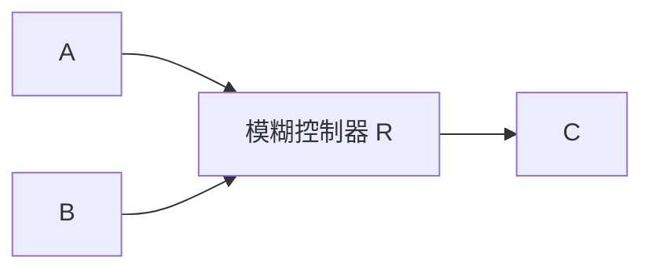

# 3.5.2 模糊推理

常用的有两种模糊推理语句,即

$$\text { If } A \text { then } B \text { else } C\text { If } A \text { and } B \text { then } C$$

下面以第二种推理语句为例进行探讨,该语句可构成一个简单的模糊控制器,如图 3-10 所示。

flowchart

图 3-10 两输入单输出模糊控制器

其中，A, B, C 分别为论域 U 上的模糊集合，A 为误差信号上的模糊子集，B 为误差变化率上的模糊子集，C 为控制器输出上的模糊子集。

常用的模糊推理有两种方法: Zadeh 法和 Mamdani 法。Mamdani 推理法是一种模糊控制中普遍使用的方法, 其本质是一种合成推理方法。

模糊推理语句“If A and B then C”蕴涵的关系为 $(A \land B \rightarrow C)$ ，根据Mamdani模糊推理方法， $A \in U, B \in U, C \in U$ 是三元模糊关系，其关系矩阵R为

$$\boldsymbol {R} = (\boldsymbol {A} \times \boldsymbol {B}) ^ {\mathrm{Tl}} \circ \boldsymbol {C} \tag {3.27}$$

式中， $(\boldsymbol{A} \times \boldsymbol{B})^{\mathrm{T1}}$ 为模糊关系矩阵 $(\boldsymbol{A} \times \boldsymbol{B})_{m \times n}$ 构成的 $m \times n$ 列向量，T1 为列向量转换，n 和 m 分别为 A 和 B 论域元素的个数。

基于 Mamdani 模糊推理方法, 根据模糊关系 R, 可求得给定输入 $A_{1}$ 和 $B_{1}$ 对应的输出 $C_{1}$ , 即

$$\mathbf {C} _ {1} = (\mathbf {A} _ {1} \times \mathbf {B} _ {1}) ^ {\mathrm{T2}} \circ \mathbf {R} \tag {3.28}$$

式中， $(\boldsymbol{A}_{1},\boldsymbol{B}_{1})^{\mathrm{T2}}$ 为模糊关系矩阵 $(\boldsymbol{A}_{1}\times\boldsymbol{B}_{1})_{m\times n}$ 构成的 $m\times n$ 行向量，T2为行向量转换。

【例 3.10】设论域 $X=\{a_{1},a_{2},a_{3}\},Y=\{b_{1},b_{2},b_{3}\},Z=\{c_{1},c_{2},c_{3}\}$ ，已知 $A=\frac{0.5}{a_{1}}+\frac{1}{a_{2}}+\frac{0.1}{a_{3}},B=\frac{0.1}{b_{1}}+\frac{1}{b_{2}}+\frac{0.6}{a_{3}},C=\frac{0.4}{c_{1}}+\frac{1}{c_{2}}$ 。试确定“If A and B then C”所决定的模糊关系 R，以及输入为 $A_{1}=\frac{1.0}{a_{1}}+\frac{0.5}{a_{2}}+\frac{0.1}{a_{3}},B_{1}=\frac{0.1}{b_{1}}+\frac{0.5}{b_{2}}+\frac{1}{b_{3}}$ 时的输出 $C_{1}$ 。

解 采用模糊交算子式(3.13)来实现 A 与 B 的“与”关系,则

$$
\boldsymbol {A} \times \boldsymbol {B} = \boldsymbol {A} ^ {\mathrm{T}} \wedge \boldsymbol {B} = \left[ \begin{array}{l} 0. 5 \\ 1 \\ 0. 1 \end{array} \right] \wedge [ 0. 1 1 0. 6 ] = \left[ \begin{array}{l l l} 0. 1 & 0. 5 & 0. 5 \\ 0. 1 & 1. 0 & 0. 6 \\ 0. 1 & 0. 1 & 0. 1 \end{array} \right]
$$

将 $A \times B$ 矩阵扩展成如下列向量
