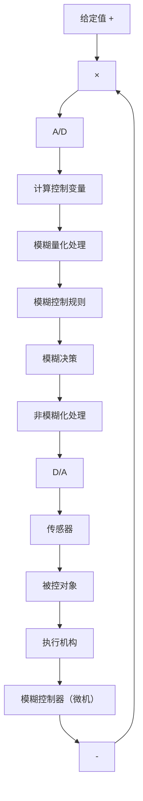

# 4.1.1 模糊控制原理

模糊控制(Fuzzy Control)是以模糊集理论、模糊语言变量和模糊逻辑推理为基础的一种智能控制方法,它从行为上模仿人的模糊推理和决策过程。该方法首先将操作人员或专家经验编成模糊规则,然后将来自传感器的实时信号模糊化,将模糊化后的信号作为模糊规则的输入,完成模糊推理,将推理后得到的输出量加到执行器上。

模糊控制的基本原理框图如图 4-1 所示。它的核心部分为模糊控制器，如图中点画线框中部分所示，模糊控制器的控制律由计算机的程序实现。实现一步模糊控制算法的过程描述如下：微机经中断采样获取被控制量的精确值，然后将此量与给定值比较得到误差信号 E，一般选误差信号 E 作为模糊控制器的一个输入量。把误差信号 E 的精确量进行模糊化变成模糊量。误差 E 的模糊量可用相应的模糊语言表示，得到误差 E 的模糊语言集合的一个子集 e（e 是一个模糊向量），再由 e 和模糊关系 R 根据推理的合成规则进行模糊决策，得到模糊控制量 u，即

$$\boldsymbol {u} = \boldsymbol {e} \circ \boldsymbol {R} \tag {4.1}$$

flowchart

图 4-1 模糊控制原理框图

由图 4-1 可知, 模糊控制系统与通常的计算机数字控制系统的主要差别是采用了模糊控制器。模糊控制器是模糊控制系统的核心, 一个模糊控制系统的性能优劣, 主要取决于模糊控制器的结构、所采用的模糊规则、合成推理算法及模糊决策的方法等因素。

模糊控制器(Fuzzy Controller, FC)也称为模糊逻辑控制器(Fuzzy Logic Controller, FLC)，由于所采用的模糊控制规则是由模糊理论中模糊条件语句来描述的，因此，模糊控制器是一种语言型控制器，故也称为模糊语言控制器(Fuzzy Language Controller, FLC)。
