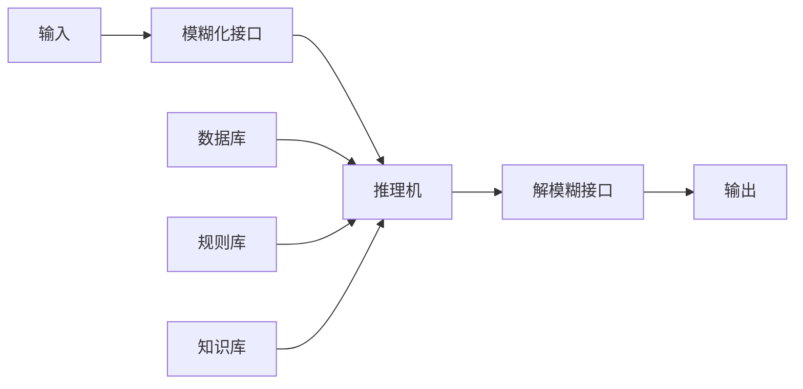

# 1. 模糊化接口(Fuzzy Interface)

模糊控制器的输入必须通过模糊化才能用于控制输出,因此,它实际上是模糊控制器的输入接口,其主要作用是将真实的确定量输入转换为一个模糊向量。对于一个模糊输入变量 e, 其模糊子集通常可以按如下方式划分:

flowchart

图 4-2 模糊控制器的组成框图

① $e=\{负大,负小,零,正小,正大\}=\{NB,NS,ZO,PS,PB\}$

② $e = \{\text{负大,负中,负小,零,正小,正中,正大}\} = \{\mathrm{NB},\mathrm{NM},\mathrm{NS},\mathrm{ZO},\mathrm{PS},\mathrm{PM},\mathrm{PB}\}$

③ $e=\{负大,负中,负小,零负,零正,正小,正中,正大\}=\{NB,NM,NS,NZ,PZ,PS,PM,PB\}$

将方式 ③ 用三角形隶属度函数表示, 如图 4-3 所示。

line

| Position | Value |
| --- | --- |
| -12 | 0 |
| -10 | 0 |
| -8 | 0 |
| -6 | 0 |
| -4 | 0 |
| -2 | 0 |
| 0 | 0 |
| 2 | 0 |
| 4 | 0 |
| 6 | 0 |
| 8 | 0 |
| 10 | 0 |
| 12 | 0 |
u(e) for NB and NM; u(e) for NS; u(e) for NZ; u(e) for PZ; u(e) for PS; u(e) for PM; u(e) for PB.

图 4-3 模糊子集和模糊化等级
