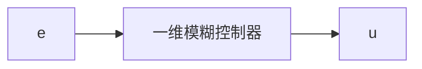
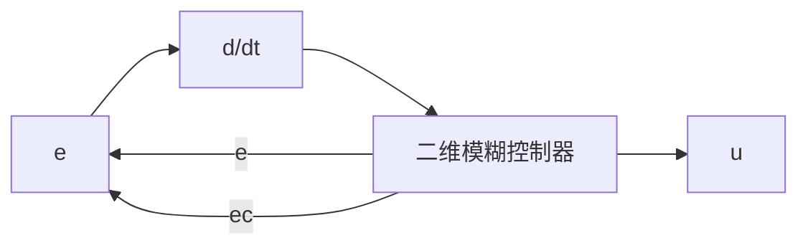
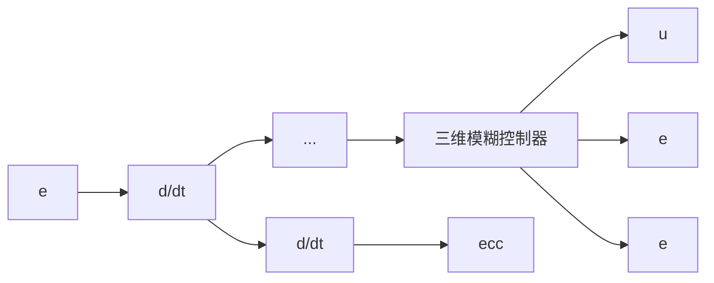

# 1. 单变量模糊控制器

在单变量模糊控制器(Single Variable Fuzzy Controller, SVFC)中, 将其输入变量的个数定义为模糊控制的维数, 如图 4-5 所示。

flowchart

```mermaid
graph LR
    A["e"] --> B["一维模糊控制器"]
    B --> C["u"]
```

(a) 一维模糊控制器

flowchart

```mermaid
graph LR
    e --> d/dt
    d/dt --> 二维模糊控制器
    二维模糊控制器 --> u
    二维模糊控制器 -->|e| e
    二维模糊控制器 -->|ec| e
```

(b) 二维模糊控制器

flowchart

```mermaid
graph LR
    e --> A["d/dt"]
    A --> B["..."]
    B --> C["三维模糊控制器"]
    C --> u
    A --> D["d/dt"]
    D --> E["ecc"]
    C --> F["e"]
    C --> G["e"]
```

(c) 三维模糊控制器  
图 4-5 单变量模糊控制器
