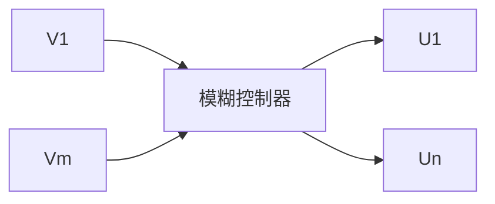

# 2. 多变量模糊控制器

一个多变量模糊控制器(Multiple Variable Fuzzy Controller, MVFC)所采用的模糊控制器

flowchart

图 4-6 多变量模糊控制器

具有多变量结构,如图 4-6 所示。

要直接设计一个多变量模糊控制器是相当困难的,可利用模糊控制器本身的解耦特点,通过模糊关系方程求解,在控制器结构上实现解耦,即将一个多输入、多输出(MIMO)的模糊控制器分解成若干个多输入、单输出(MISO)的模糊控制器,这样可采用单变量模糊控制方法进行设计。
