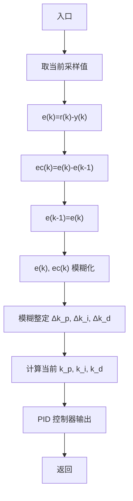

# (2) $k_{i}$ 整定原则

采用积分分离策略，即误差在零附近时， $\Delta k_{i}$ 取正，否则 $\Delta k_{i}$ 取零。 $k_{i}$ 整定的模糊规则表见表4-12。

表 4-11 $k_{\mathrm{p}}$ 整定的模糊规则表

<table><tr><td> $\begin{array}{c}ec\\ \Delta k_{p}\\ e\end{array}$ </td><td>N</td><td>Z</td><td>P</td></tr><tr><td>N</td><td>N</td><td>N</td><td>N</td></tr><tr><td>Z</td><td>N</td><td>P</td><td>P</td></tr><tr><td>P</td><td>P</td><td>P</td><td>P</td></tr></table>

表 4-12 $k_{i}$ 整定的模糊规则表

<table><tr><td> $\begin{array}{c}ec\\ \Delta {k}_{\mathrm{i}}\\ e\end{array}$ </td><td>N</td><td>Z</td><td>P</td></tr><tr><td>N</td><td>Z</td><td>Z</td><td>Z</td></tr><tr><td>Z</td><td>P</td><td>P</td><td>P</td></tr><tr><td>P</td><td>Z</td><td>Z</td><td>Z</td></tr></table>

将系统误差 e 和误差变化率 ec 变化范围定义为模糊集上的论域, 即

$$e, e c = \{- 1, 0, 1 \} \tag {4.9}$$

其模糊子集为 $e, c = \{N, O, P\}$ ，子集中元素分别代表负，零，正。设 e, ec 和 $k_{p}, k_{i}$ 均服从正态分布，因此可得出各模糊子集的隶属度，根据各模糊子集的隶属度赋值表和各参数模糊控制模型，应用模糊合成推理设计 PI 参数的模糊矩阵表，查出修正参数代入下式计算

$$k _ {\mathrm{p}} = k _ {\mathrm{p0}} + \Delta k _ {\mathrm{p}}, k _ {\mathrm{i}} = k _ {\mathrm{i0+}} \Delta k _ {\mathrm{i}} \tag {4.10}$$

在线运行过程中,控制系统通过对模糊逻辑规则的结果处理、查表和运算,完成对 PID 参数的在线自校正。其工作流程图如图 4-21 所示。

flowchart

图 4-21 模糊 PID 工作流程图
