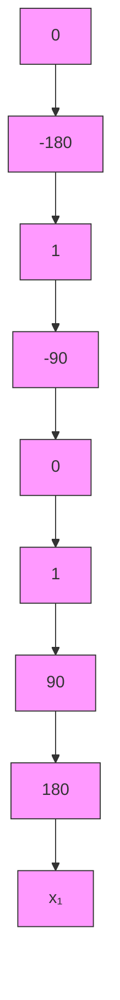

# 2. 基于 4 条模糊规则的设计

为了能在大范围的初始角度下进行控制,在上述两条规则的基础上,需要增加模糊规则数量。

根据倒立摆模型可知， $x_{1}\rightarrow \pm \frac{\pi}{2} (|x_{1}| > \frac{\pi}{2})$ 时， $\sin x_1\to \pm 1\to \frac{2}{\pi} x_1$ ，由于 $\beta = \cos (88^{\circ})$ ，则 $\cos (x_1) = \cos (180^\circ -88^\circ) = -\cos (88^\circ) = -\beta ;$ 当 $x_{1}\rightarrow \pi$ 时， $\sin x_1\to 0,\cos x_1\to -1$ ，则近似有 $\dot{x}_2 = \frac{au}{4l / 3 - aml}$ 。由此可得以下另外两条T-S模糊规则。

规则 3: IF $x_{1}(t)$ is about $\pm\frac{\pi}{2}(|x_{1}|>\frac{\pi}{2})$ , THEN $\dot{\boldsymbol{x}}(t)=\boldsymbol{A}_{3}\boldsymbol{x}(t)+\boldsymbol{B}_{3}u(t)$

规则 4: IF $x_{1}(t)$ is about $\pm\pi$ , THEN $\dot{\boldsymbol{x}}(t)=\boldsymbol{A}_{4}\boldsymbol{x}(t)+\boldsymbol{B}_{4}u(t)$

式中， $A_{3}=\begin{bmatrix}0&1\\ \frac{2g}{\pi(4l/3-aml\beta^{2})}&0\end{bmatrix},B_{3}=\begin{bmatrix}0\\ \frac{\alpha\beta}{4l/3-aml\beta^{2}}\end{bmatrix},A_{4}=\begin{bmatrix}0&1\\ 0&0\end{bmatrix},B_{4}=\begin{bmatrix}0\\ \frac{\alpha}{4l/3-aml}\end{bmatrix}.$

根据倒立摆的运动情况,设计2条模糊控制规则。

Rule3: If $x_{1}(t)$ is about $\pm \frac{\pi}{2} (|x_1| > \frac{\pi}{2})$ then $u = K_3x(t)$

Rule4: If $x_{1}(t)$ is about $\pm\pi$ then $u = K_{4}x(t)$

如图 4-36 所示,为具有 4 条规则的隶属函数示意图,隶属函数有交集的规则分别是规则 1、规则 2、规则 3 和规则 4。

flowchart

图 4-36 模糊隶属度函数示意图

采用 PDC 方法, 根据式(4.15), 设计基于 T-S 模糊控制器为

$$u = w _ {1} \left(x _ {1}\right) \mathbf {K} _ {1} x (t) + w _ {2} \left(x _ {1}\right) \mathbf {K} _ {2} x (t) + w _ {3} \left(x _ {1}\right) \mathbf {K} _ {3} x (t) + w _ {4} \left(x _ {1}\right) \mathbf {K} _ {4} x (t) \tag {4.17}$$

根据倒立摆的两条 T-S 模糊模型规则,隶属函数应按图 4-36 进行设计。仿真中采用三角形隶属函数实现摆角度 $x_{1}(t)$ 的模糊化。仿真程序为 chap4\_10mf.m, 如图 4-37 所示。

line

