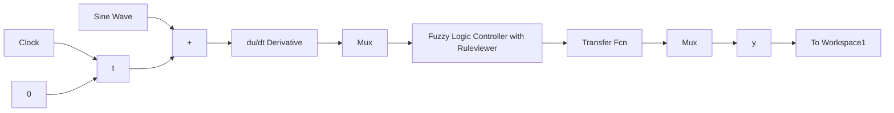

(2) Simulink 仿真程序: chap4\_3sim. mdl   


<details>
<summary>flowchart</summary>


</details>

(3) 作图程序: chap4\_3plot.m  
```javascript
close all;
figure(1);
plot(t,y(:,1),'r',t,y(:,2),'k:','linewidth',2); 
```

```javascript
xlabel('time(s)');ylabel('yd,y');
legend('Ideal position signal', 'position tracking'); 
```

洗衣机模糊控制:包括以下 3 个程序。

(1) 污泥和油脂隶属函数设计仿真程序: chap4\_4. m  
```matlab
% Define N+1 triangle membership function
clear all;
close all;
N = 2;

x = 0 : 0.1 : 100;
for i = 1 : N + 1
    f(i) = 100 / N * (i - 1);
end

u = trimf(x, [f(1), f(1), f(2)]);
figure(1);
plot(x, u);

for j = 2 : N
    u = trimf(x, [f(j - 1), f(j), f(j + 1)]);
    hold on;
    plot(x, u);
end

u = trimf(x, [f(N), f(N + 1), f(N + 1)]);
hold on;
plot(x, u);
xlabel('x');
ylabel('Degree of membership'); 
```

(2) 洗涤时间隶属函数设计仿真程序: chap4\_5.m  
```matlab
% Define N+1 triangle membership function
clear all;
close all;
z = 0 : 0.1 : 60;

u = trimf(z, [0, 0, 10]);
figure(1);
plot(z, u);

u = trimf(z, [0, 10, 25]);
hold on;
plot(z, u);

u = trimf(z, [10, 25, 40]);
hold on;
plot(z, u);

u = trimf(z, [25, 40, 60]); 
```

```javascript
hold on;
plot(z,u);
u = trimf(z,[40,60,60]);
hold on;
plot(z,u);
xlabel('z');
ylabel('Degree of membership'); 
```

(3) 洗衣机模糊控制系统仿真程序: chap4\_6.m  
```matlab
% Fuzzy Control for washer
clear all;
close all;

a = newfis('fuzz_wash');

a = addvar(a, 'input', 'x', [0, 100]);    % Fuzzy Stain
a = addmf(a, 'input', 1, 'SD', 'trimf', [0, 0, 50]);
a = addmf(a, 'input', 1, 'MD', 'trimf', [0, 50, 100]);
a = addmf(a, 'input', 1, 'LD', 'trimf', [50, 100, 100]);

a = addvar(a, 'input', 'y', [0, 100]);    % Fuzzy Axunge
a = addmf(a, 'input', 2, 'NG', 'trimf', [0, 0, 50]);
a = addmf(a, 'input', 2, 'MG', 'trimf', [0, 50, 100]);
a = addmf(a, 'input', 2, 'LG', 'trimf', [50, 100, 100]);

a = addvar(a, 'output', 'z', [0, 60]);    % Fuzzy Time
a = addmf(a, 'output', 1, 'VS', 'trimf', [0, 0, 10]);
a = addmf(a, 'output', 1, 'S', 'trimf', [0, 10, 25]);
a = addmf(a, 'output', 1, 'M', 'trimf', [10, 25, 40]);
a = addmf(a, 'output', 1, 'L', 'trimf', [25, 40, 60]);
a = addmf(a, 'output', 1, 'VL', 'trimf', [40, 60, 60]);
