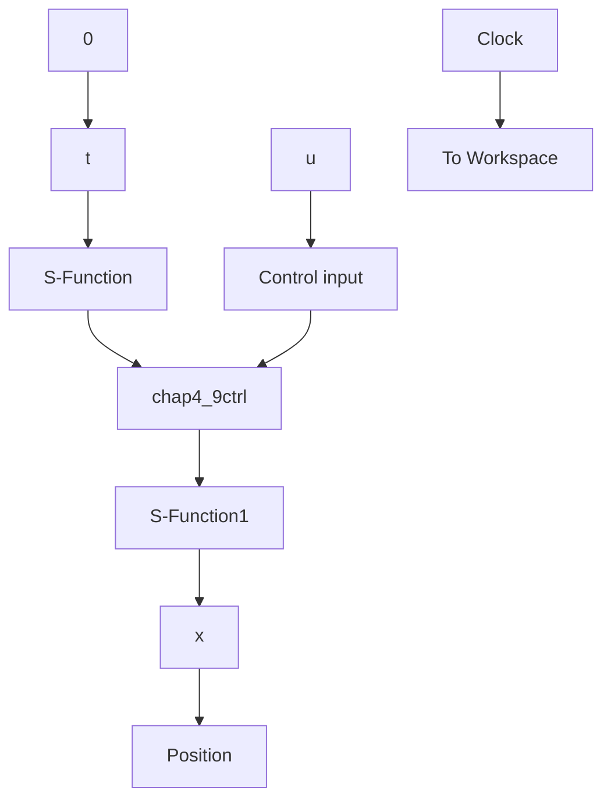

# 1. 基于两条模糊规则的设计仿真程序

(1) 控制器增益求解程序: chap4\_9design.m

```matlab
clear all;
close all;

g = 9.8; m = 2.0; M = 8.0; l = 0.5;
a = l / (m + M); beta = cos(88* pi/180);

a1 = 4* l/3 - a* m* l;
A1 = [0 1; g/a1 0];
B1 = [0 ; -a/a1];
a2 = 4* l/3 - a* m* l* beta^2;
A2 = [0 1; 2* g/(pi* a2) 0];
B2 = [0; -a* beta/a2];

P = [-3 - 3i; -3 + 3i]; % Stable pole point
K1 = place(A1, B1, P)
K2 = place(A2, B2, P)

save K_file K1 K2; 
```

(2) 隶属函数设计程序: chap4\_9mf.m

```matlab
clear all;
close all;
L1 = -pi/2; L2 = pi/2;
L = L2 - L1;
h = pi/2;
N = L/h; 
```

```matlab
T = 0.01;

x = L1:T:L2;
for i = 1:N + 1
    e(i) = L1 + L/N* (i - 1);
end

w = trimf(x, [e(1), e(2), e(3)]); % The middle MF
plot(x, w, 'r', 'linewidth', 2);

for j = 1:N
    if j == 1
    w = trimf(x, [e(1), e(1), e(2)]); % The first MF
    elseif j == N
    w = trimf(x, [e(N), e(N + 1), e(N + 1)]); % The last MF
    end
    hold on;
    plot(x, w, 'b', 'linewidth', 2);
end

xlabel('x');ylabel('Membership function');
legend('First Rule', 'Second rule'); 
```

(3) Simulink 主程序: chap4\_9sim. mdl


<details>
<summary>flowchart</summary>


</details>

(4) 模糊控制 S 函数: chap4\_9ctrl. m

```matlab
function [sys,x0,str,ts] = spacemodel(t,x,u,flag)
switch flag,
case 0,
    [sys,x0,str,ts] = mdlInitializeSizes;
case 3,
    sys = mdlOutputs(t,x,u);
case {2,4,9}
    sys = [];
otherwise
    error(['Unhandled flag = ',num2str(flag)]);
end
function [sys,x0,str,ts] = mdlInitializeSizes
sizes = simsizes;
sizes.NumContStates = 0; 
```

```matlab
sizes.NumDiscStates = 0;
sizes.NumOutputs = 1;
sizes.NumInputs = 2;
sizes.DirFeedthrough = 1;
sizes.NumSampleTimes = 1;
sys = simsizes(sizes);
x0 = [];
str = [];
ts = [0 0];
function sys = mdlOutputs(t, x, u)
x = [u(1); u(2)]; 
```

```txt
load K_file;
ut1 = -K1* x;
ut2 = -K2* x; 
```

```txt
L1 = -pi/2; L2 = pi/2;
L = L2 - L1; 
```

```matlab
N = 2;
for i = 1:N + 1
    e(i) = L1 + L/N* (i - 1);
end 
```

```matlab
w1 = trimf(x(1), [e(1), e(2), e(3)]); % The middle
if x(1) <= 0
    w2 = trimf(x(1), [e(1), e(1), e(2)]); % The first
else
    w2 = trimf(x(1), [e(2), e(3), e(3)]); % The last
end
% h1 + h2
ut = (w1* ut1 + w2* ut2) / (w1 + w2);
sys(1) = ut; 
```
