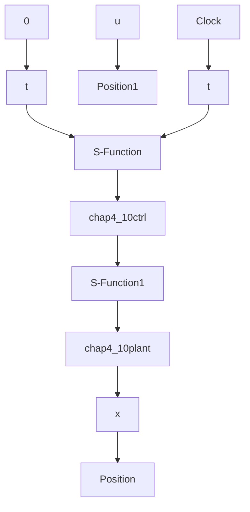

# (1) 控制器增益求解程序: chap4\_10design.m

```txt
clear all;
close all;
```

```matlab
g = 9.8; m = 2.0; M = 8.0; l = 0.5;
a = l / (m + M); beta = cos(88*pi/180);

a1 = 4* l/3 - a*m* l;
A1 = [0 1; g/a1 0];
B1 = [0 ; -a/a1];

a2 = 4* l/3 - a*m* l* beta^2;

A2 = [0 1; 2*g/(pi*a2) 0];
B2 = [0; -a* beta/a2];

A3 = [0 1; 2*g/(pi*a2) 0];
B3 = [0; a* beta/a2];

A4 = [0 1; 0 0];
B4 = [0; a/a1];

P = [-3 - 3i; -3 + 3i]; % Stable poles
K1 = place(A1, B1, P)
K2 = place(A2, B2, P)
K3 = place(A3, B3, P)
K4 = place(A4, B4, P)

save K_file K1 K2 K3 K4; 
```

(2) 隶属函数设计程序: chap4\_10mf.m  
```matlab
clear all;
close all;
L1 = -pi; L2 = pi;
L = L2 - L1;

h = pi/2;
N = L/h;
T = 0.01;

x = L1:T:L2;
for i = 1:N+1
    e(i) = L1 + L/N*(i-1);
end

figure(2);
% w1
w1 = trimf(x, [e(2), e(3), e(4)]); % Rule 1:x1 is to zero
plot(x, w1, 'r', 'linewidth', 2);
% w2, Rule 2: x1 is about +- pi/2, but smaller
    w2 = trimf(x, [e(2), e(2), e(3)]);
hold on
plot(x, w2, 'b', 'linewidth', 2);
    w2 = trimf(x, [e(3), e(4), e(4)]);
hold on 
```

```matlab
plot(x,w2,'b','linewidth',2);

% w3, Rule 3: x1 is about +-pi/2, but bigger
    w3 = trimf(x, [e(1), e(2), e(2)]);
hold on;
plot(x,w3,'g','linewidth',2);
    w3 = trimf(x, [e(4), e(4), e(5)]);
hold on;
plot(x,w3,'g','linewidth',2);

% w4, Rule 4: x1 is about +-pi
    w4 = trimf(x, [e(1), e(1), e(2)]);
hold on;
plot(x,w4,'k','linewidth',2);
    w4 = trimf(x, [e(4), e(5), e(5)]);
hold on;
plot(x,w4,'k','linewidth',2); 
```

(3) Simulink 主程序: chap4\_10sim.mdl


<details>
<summary>flowchart</summary>


</details>

(4) 模糊控制 S 函数: chap4\_10ctrl. m

```matlab
function [sys,x0,str,ts] = spacemodel(t,x,u,flag)
switch flag,
case 0,
    [sys,x0,str,ts] = mdlInitializeSizes;
case 3,
    sys = mdlOutputs(t,x,u);
case {2,4,9}
    sys = [];
otherwise
    error(['Unhandled flag = ',num2str(flag)]);
end
function [sys,x0,str,ts] = mdlInitializeSizes
sizes = simsizes;
sizes.NumContStates = 0;
sizes.NumDiscStates = 0;
sizes.NumOutputs = 1; 
```

```matlab
sizes.NumInputs = 2;
sizes.DirFeedthrough = 1;
sizes.NumSampleTimes = 1;
sys = simsizes(sizes);
x0 = [];
str = [];
ts = [0 0];
function sys = mdlOutputs(t, x, u)
x = [u(1); u(2)]; 
```

```txt
load K_file;
ut1 = -K1* x;
ut2 = -K2* x;
ut3 = -K3* x;
ut4 = -K4* x; 
```
